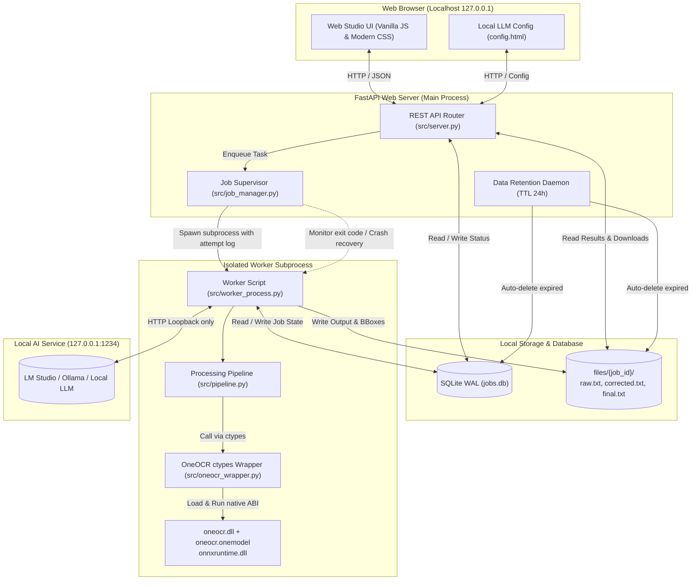
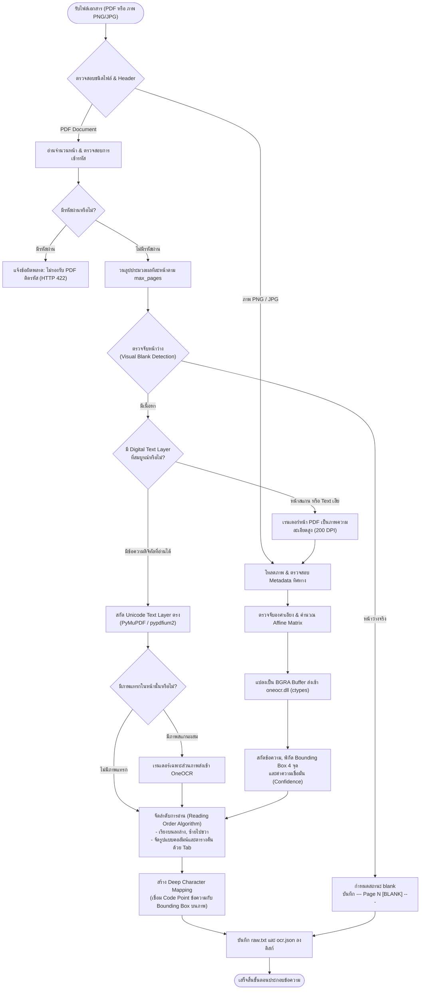
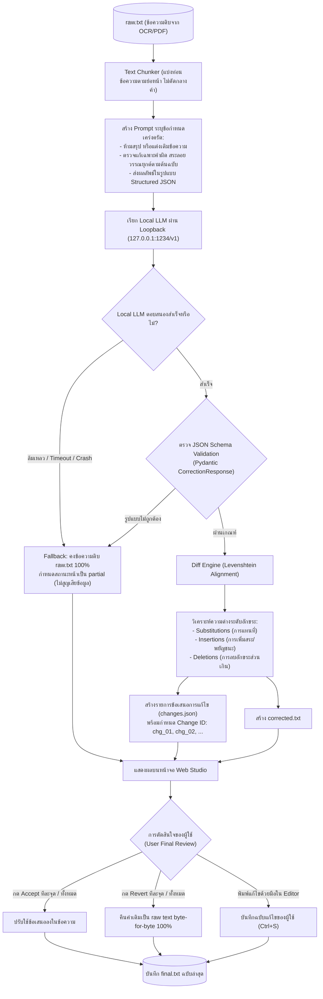
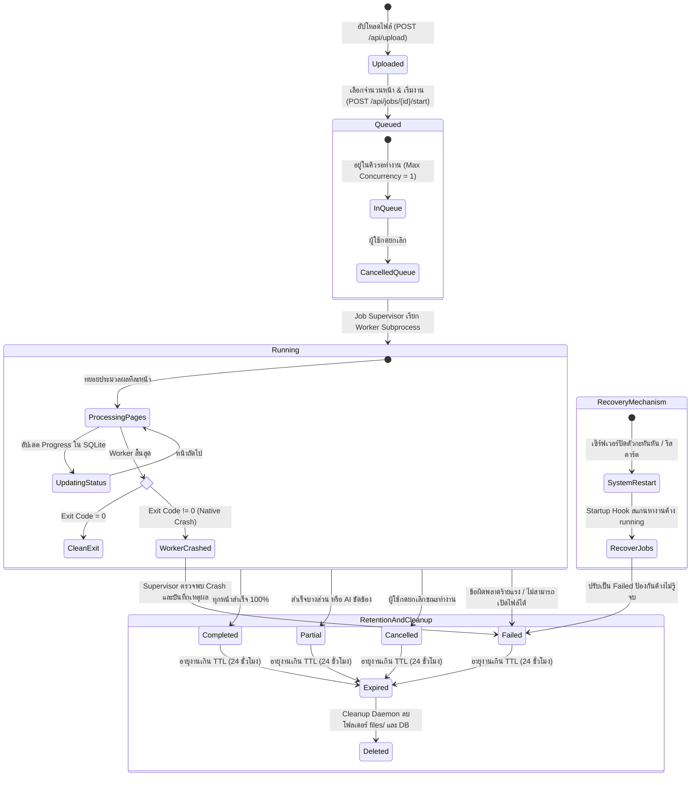

# Local Thai OCR Web

[-0078D6.svg?logo=windows)](https://microsoft.com)
[-3776AB.svg?logo=python)](https://python.org)
[](https://fastapi.tiangolo.com)
[-critical.svg)](#บทบาทของ-oneocr-และ-local-ai)
[](#การตั้งค่า-local-ai-ตรวจแก้)
[](#ความปลอดภัยและการทำงานแบบ-offline)

เว็บแอปพลิเคชันสำหรับแปลงเอกสาร **PDF และภาพภาษาไทยเป็นข้อความ UTF-8** ขับเคลื่อนด้วย **OneOCR** (เอนจิน OCR ภาษาไทยแบบเนทีฟจาก Windows 11 Snipping Tool ผ่าน Python `ctypes`) พร้อมระบบจัดลำดับข้อความอัจฉริยะ (Smart Layout Assembly) และผสานพลัง **Local AI (LLM/VLM)** ช่วยตรวจแก้คำผิด สระ และวรรณยุกต์ โดยประมวลผล **ภายในเครื่อง 100% (Localhost Single-User)** โดยไม่ส่งข้อมูลออกนอกเครื่อง พร้อมหน้าเว็บ **Web Studio** สำหรับตรวจทาน เทียบภาพต้นฉบับ แก้ไข และส่งออกไฟล์

---

## สารบัญ

- [จุดเด่นของระบบ (Key Features)](#จุดเด่นของระบบ-key-features)
- [สถาปัตยกรรมและแผนภาพการทำงาน (Architecture & Diagrams)](#สถาปัตยกรรมและแผนภาพการทำงาน-architecture--diagrams)
  - [1. แผนภาพสถาปัตยกรรมระบบและการแยก Process](#1-แผนภาพสถาปัตยกรรมระบบและการแยก-process)
  - [2. แผนภาพการประมวลผลและการจัดเส้นทางเอกสาร (Intelligent Page Routing)](#2-แผนภาพการประมวลผลและการจัดเส้นทางเอกสาร-intelligent-page-routing)
  - [3. แผนภาพการตรวจแก้ด้วย Local AI และ Diff Engine](#3-แผนภาพการตรวจแก้ด้วย-local-ai-และ-diff-engine)
  - [4. แผนภาพวงจรสถานะงานและการกู้คืนข้อผิดพลาด (Job Lifecycle & Fault Tolerance)](#4-แผนภาพวงจรสถานะงานและการกู้คืนข้อผิดพลาด-job-lifecycle--fault-tolerance)
  - [5. แผนภาพขั้นตอนการทำงานของผู้ใช้บนหน้าเว็บ (End-to-End User Experience Flow)](#5-แผนภาพขั้นตอนการทำงานของผู้ใช้บนหน้าเว็บ-end-to-end-user-experience-flow)
- [การติดตั้งและเริ่มต้นใช้งาน (Getting Started)](#การติดตั้งและเริ่มต้นใช้งาน-getting-started)
  - [ความต้องการของระบบ](#ความต้องการของระบบ-prerequisites)
  - [วิธีที่ 1: รันด่วนด้วยชุดติดตั้งพร้อมแจกจ่าย (`publish/`)](#วิธีที่-1-รันด่วนด้วยชุดติดตั้งพร้อมแจกจ่าย-publish)
  - [วิธีที่ 2: ติดตั้งจาก Source Code สำหรับนักพัฒนา](#วิธีที่-2-ติดตั้งจาก-source-code-สำหรับนักพัฒนา)
- [การตั้งค่า Local AI ตรวจแก้](#การตั้งค่า-local-ai-ตรวจแก้)
- [สัญญาข้อมูลและไฟล์ผลลัพธ์ (Data Contract)](#สัญญาข้อมูลและไฟล์ผลลัพธ์-data-contract)
- [โครงสร้างโฟลเดอร์ (Repository Structure)](#โครงสร้างโฟลเดอร์-repository-structure)
- [ผลการทดสอบและเกณฑ์ตรวจรับ (Verification & Benchmarks)](#ผลการทดสอบและเกณฑ์ตรวจรับ-verification--benchmarks)
- [ชุดข้อมูลทดสอบที่อนุมัติ](#ชุดข้อมูลทดสอบที่อนุมัติ-approved-dataset)
- [เอกสารที่เกี่ยวข้องและการกำกับดูแล](#เอกสารที่เกี่ยวข้องและการกำกับดูแล)

---

## จุดเด่นของระบบ (Key Features)

1. **OneOCR ภาษาไทยแท้ (High Accuracy OCR):**
   - โหลดโมเดล `oneocr.dll` และ `oneocr.onemodel` ผ่าน Python `ctypes` โดยตรง ไม่ต้องติดตั้งโปรแกรม C++ เพิ่มเติม
   - อัตราความผิดพลาดต่ำมาก (**CER 0.04%** บนเอกสารไทยตัวพิมพ์ชัด และ **CER รวม 0.83%** บนชุดตรวจรับ)
2. **Hybrid PDF Pipeline (ตรวจจับและจัดเส้นทางอัจฉริยะ):**
   - แยกแยะหน้าเอกสารอัตโนมัติ: ดึง Text Layer ตรงจาก Digital PDF ที่สมบูรณ์ หรือเรนเดอร์ภาพความละเอียดสูงเพื่อทำ OCR สำหรับหน้าสแกน/ภาพ
   - ตรวจจับหน้าว่างจริง (`blank`) ไม่ทิ้งหน้าและไม่แสดงเป็นข้อความว่างลึกลับ
3. **Interactive Dual-Pane Web Studio:**
   - หน้าจอทำงานแบบแยก 2 ฝั่ง (ต้นฉบับ vs ข้อความที่แปลงได้)
   - **Bidirectional Bounding Box Sync:** คลิกคำ/บรรทัดบนข้อความ กรอบสีบนภาพต้นฉบับจะเลื่อนและไฮไลต์ตำแหน่งทันที และสามารถคลิกกรอบบนภาพเพื่อวิ่งไปยังข้อความได้เช่นกัน
   - เครื่องมือขยาย ซูม รีเซ็ตภาพ และรองรับการหมุน/แก้เอียง (Deskew)
4. **Local AI Correction & Diff Engine:**
   - เชื่อมต่อกับ Local LLM (เช่น LM Studio, Ollama หรือโมเดล OpenAI-compatible บน localhost) เพื่อตรวจแก้คำผิดและสระลอย
   - มีระบบ **Diff Engine** คำนวณการเปลี่ยนแปลงละเอียดระดับอักขระ
   - ปุ่ม **Accept / Revert** ทีละจุด หรือทั้งหมด พร้อมการันตีคืนค่า raw text byte-for-byte ได้ 100%
5. **Crash Isolation & Resilient Architecture:**
   - แยก **FastAPI Web Server** ออกจาก **OCR Worker Subprocess** อย่างเด็ดขาด ป้องกัน Native DLL Crash ไม่ให้เซิร์ฟเวอร์หลักหยุดทำงาน
   - จัดการคิวงานด้วย SQLite โหมด Write-Ahead Logging (WAL) พร้อมกู้คืนงานที่ค้าง (`recovering interrupted jobs`) หลังเปิดระบบใหม่
   - กลไกป้องกันการแก้ไขชนกันหลายแท็บ (Multi-tab Conflict Detection ด้วย ETag/Revision คืนค่า HTTP 409)
6. **Data Retention & Anti-Resurrection:**
   - ระบบกำจัดไฟล์ชั่วคราวและงานหมดอายุตาม TTL (ค่าเริ่มต้น 24 ชั่วโมง)
   - ป้องกันสภาวะ Race Condition: หากงานถูกลบไปแล้ว Worker จะยุติการเขียนไฟล์กลับคืนทันที (0 Resurrection)
7. **ความเป็นส่วนตัวและ Offline 100%:**
   - เซิร์ฟเวอร์ผูกเข้ากับ `127.0.0.1` (Loopback Only) ปฏิเสธการเข้าถึงจาก IP ภายนอกด้วย HTTP 403 Forbidden
   - ประมวลผลและเก็บข้อมูลบนเครื่องของผู้ใช้เท่านั้น ไม่ส่งข้อมูลใด ๆ ออกนอกเครือข่าย

---

## สถาปัตยกรรมและแผนภาพการทำงาน (Architecture & Diagrams)

### 1. แผนภาพสถาปัตยกรรมระบบและการแยก Process

แผนภาพแสดงการแยก Process ระหว่าง Web Server กับ OCR Worker อย่างเด็ดขาด เพื่อป้องกันปัญหา Native DLL Crash ส่งผลกระทบต่อการให้บริการของระบบ:



---

### 2. แผนภาพการประมวลผลและการจัดเส้นทางเอกสาร (Intelligent Page Routing)

ขั้นตอนการตัดสินใจเลือกเส้นทางระหว่าง Digital Text Extraction หรือ OneOCR พร้อมการจัดลำดับการอ่านและการทำ Deep Bounding Box Mapping:



---

### 3. แผนภาพการตรวจแก้ด้วย Local AI และ Diff Engine

กระบวนการส่งข้อความเข้า Local LLM, การตรวจสอบความถูกต้องของโครงสร้างผลลัพธ์ (Schema Validation), การคำนวณ Diff อักขระต่ออักขระ และการให้สิทธิ์ผู้ใช้ตัดสินใจยอมรับหรือคืนค่า:



---

### 4. แผนภาพวงจรสถานะงานและการกู้คืนข้อผิดพลาด (Job Lifecycle & Fault Tolerance)

แผนผังแสดง State Machine ของงาน (Job), การรับมือกรณี Worker Crash, การกู้คืนงานค้างหลังรีสตาร์ต และระบบทำความสะอาดข้อมูลตามอายุงาน (TTL):



---

### 5. แผนภาพขั้นตอนการทำงานของผู้ใช้บนหน้าเว็บ (End-to-End User Experience Flow)

แผนผังแสดงลำดับขั้นตอนการใช้งานจริงตั้งแต่เข้าสู่หน้าเว็บ อัปโหลด กำหนดขอบเขต ตรวจทาน ไปจนถึงการส่งออกไฟล์:

```mermaid
flowchart TD
    Step1["1. เข้าสู่หน้าเว็บหลัก http://127.0.0.1:8000"] --> Step2["2. ลากไฟล์ PDF / PNG / JPG มาวาง หรือคลิกเลือกไฟล์"]
    Step2 --> Step3["3. ระบบตรวจสอบไฟล์ & อ่านจำนวนหน้าทั้งหมดอัตโนมัติ"]
    
    Step3 --> Step4["4. ผู้ใช้กำหนดเงื่อนไขการประมวลผล:<br/>- เลือกจำนวนหน้าเริ่มต้นที่ต้องการแปลง (1 ถึงสูงสุด 100 หน้า)<br/>- เลือกโหมด: 'OneOCR อย่างเดียว' หรือ 'OneOCR + AI ตรวจแก้'"]
    
    Step4 --> Step5["5. คลิกปุ่ม 'เริ่มแปลง X หน้า'"]
    Step5 --> Step6["6. หน้าจอแสดง Progress Bar & สถานะประมวลผลแบบ Real-time<br/>(พร้อมปุ่มยกเลิกงาน Cancel Job หากต้องการ)"]
    
    Step6 --> Step7["7. เมื่องานเสร็จสิ้น เข้าสู่ 'Web Studio Dual-Pane Viewer'"]
    
    subgraph ReviewStudio ["พื้นที่ตรวจทานเอกสาร (Interactive Web Studio)"]
        direction LR
        LeftPane["ฝั่งซ้าย: ภาพต้นฉบับความละเอียดสูง<br/>- ซูม เข้า/ออก/รีเซ็ต<br/>- กรอบ Bounding Box สี่เหลี่ยมสีส้มครอบข้อความ"]
        SyncArrows["<==== โต้ตอบ 2 ทาง (Two-Way Sync) ====>"]
        RightPane["ฝั่งขวา: แท็บเครื่องมือ 3 รูปแบบ<br/>- แท็บ 'ฉบับสุดท้าย (Final Text)' พร้อม Editor<br/>- แท็บ 'เปรียบเทียบ AI (Diff)' พร้อมปุ่ม Accept/Revert<br/>- แท็บ 'ข้อความดิบ (Raw Text)'"]
    end
    
    Step7 --> ReviewStudio
    ReviewStudio --> Step8["8. คลิกตรวจทานจุดที่ต้องการแก้ไข:<br/>- คลิกบรรทัดข้อความ -> กรอบบนภาพจะเลื่อนและไฮไลต์ทันที<br/>- หรือคลิกกรอบบนภาพ -> ข้อความฝั่งขวาจะเลื่อนมาแสดงตำแหน่งเดียวกัน"]
    
    Step8 --> Step9["9. กดยืนยันการตรวจทาน (Mark as Reviewed) รายหน้า"]
    Step9 --> Step10["10. ดาวน์โหลดผลลัพธ์:<br/>- raw.txt (ข้อความดิบ)<br/>- corrected.txt (ฉบับ AI)<br/>- final.txt (ฉบับตรวจแก้ล่าสุด)<br/>- ดาวน์โหลดครบชุด (ZIP Bundle)"]
```



---

## การติดตั้งและเริ่มต้นใช้งาน (Getting Started)

### ความต้องการของระบบ (Prerequisites)
- **ระบบปฏิบัติการ:** Windows 10 หรือ Windows 11 (แบบ **64-bit** เท่านั้น เนื่องจาก OneOCR DLL เป็น 64-bit)
- **Python:** Python 3.10 ขึ้นไป (64-bit) พร้อม Python Launcher (`py`)
- **เว็บเบราว์เซอร์:** Google Chrome, Microsoft Edge หรือเบราว์เซอร์ Chromium ทันสมัย

---

### วิธีที่ 1: รันด่วนด้วยชุดติดตั้งพร้อมแจกจ่าย (`publish/`)

เหมาะสำหรับการนำไปติดตั้งใช้งานบน Windows เครื่องอื่นทันที โดยในโฟลเดอร์ `publish/` ได้รวบรวมไฟล์ binary, โมเดล, โค้ด และหน้าเว็บไว้อย่างครบถ้วนแล้ว:

1. เปิด **PowerShell** ในโฟลเดอร์ `publish/`
2. หาก PowerShell บล็อกการรันสคริปต์ ให้ปลดล็อกชั่วคราว:
   ```powershell
   Set-ExecutionPolicy -Scope Process Bypass
   ```
3. รันสคริปต์ติดตั้งระบบ (จะสร้าง virtual environment และดาวน์โหลด dependencies อัตโนมัติ):
   ```powershell
   .\install.ps1
   ```
4. เริ่มต้นเซิร์ฟเวอร์:
   ```powershell
   .\run_server.ps1
   ```
   *(หรือดับเบิลคลิกไฟล์ `run_server.cmd`)*
5. เปิดเบราว์เซอร์ไปที่: **`http://127.0.0.1:8000/`**

---

### วิธีที่ 2: ติดตั้งจาก Source Code สำหรับนักพัฒนา

หากต้องการพัฒนาต่อ ปรับแต่ง หรือรันชุดทดสอบ (Tests):

1. **ตรวจสอบโฟลเดอร์โมเดล OneOCR:**  
   ตรวจสอบว่ามีไฟล์ binary ครบถ้วนในโฟลเดอร์ `oneOCR/`:
   ```text
   oneOCR/
   ├── oneocr.dll        (DLL เอนจิน OneOCR)
   ├── oneocr.onemodel   (โมเดล ONNX สำหรับภาษาไทย/อังกฤษ)
   └── onnxruntime.dll   (ONNX Runtime 64-bit)
   ```

2. **สร้าง Virtual Environment และเปิดใช้งาน:**
   ```powershell
   py -3.10 -m venv venv
   .\venv\Scripts\Activate.ps1
   ```

3. **ติดตั้ง Dependencies:**
   ```powershell
   python -m pip install --upgrade pip
   python -m pip install -r publish/requirements.txt
   ```

4. **เตรียมไฟล์การตั้งค่า (`.env`):**
   ```powershell
   Copy-Item .env.example .env
   ```

5. **ทดสอบความพร้อมของ OneOCR (Smoke Test):**
   ```powershell
   python tests/smoke_test_oneocr.py
   ```
   *หากผ่านจะแสดงข้อความ `Final Smoke Test Verdict: PASS`*

6. **เริ่มการทำงานของเซิร์ฟเวอร์:**
   ```powershell
   python -m uvicorn src.server:app --host 127.0.0.1 --port 8000 --reload
   ```

---

## การตั้งค่า Local AI ตรวจแก้

ระบบรองรับการเชื่อมต่อกับ **Local LLM / VLM** ผ่าน OpenAI-compatible API (เช่น [LM Studio](https://lmstudio.ai/) หรือ [Ollama](https://ollama.com/)) โดยมีขั้นตอนดังนี้:

1. เปิดโปรแกรม Local LLM และโหลดโมเดลที่ต้องการ (เช่น `google/gemma-3-1b` หรือโมเดลภาษาไทยอื่น ๆ)
2. เริ่มการทำงานของ Local Server ที่ `http://127.0.0.1:1234/v1`
3. เข้าหน้าเว็บตั้งค่าของระบบ: **`http://127.0.0.1:8000/config.html`**
4. กรอกข้อมูลการเชื่อมต่อ:
   - **Base URL:** `http://127.0.0.1:1234/v1` *(จำกัดเฉพาะ localhost/127.0.0.1 เพื่อความปลอดภัย)*
   - **Model:** ระบุชื่อโมเดล เช่น `google/gemma-3-1b`
   - **Timeout:** ค่าเริ่มต้น `60.0` วินาที
5. กดปุ่ม **"ทดสอบการเชื่อมต่อ"** เมื่อขึ้นสถานะพร้อมใช้งาน ให้กด **"บันทึกการตั้งค่า"**
6. ค่าจะถูกบันทึกลง `.env` และมีผลกับงาน OCR+AI รอบถัดไปทันที

---

## สัญญาข้อมูลและไฟล์ผลลัพธ์ (Data Contract)

ไฟล์ต้นฉบับและผลลัพธ์ของแต่ละงานจะถูกจัดเก็บแยกตามโฟลเดอร์ใน `files/{job_id}/`:

| ชื่อไฟล์ | คำอธิบายและเนื้อหา |
|---|---|
| **`raw.txt`** | ข้อความดิบที่ประกอบตามลำดับอ่านที่ได้จาก PDF Text หรือ OneOCR ก่อนผ่าน AI |
| **`corrected.txt`** | ข้อความหลังผ่าน Local AI ตรวจแก้ตามโครงสร้าง JSON (มีเฉพาะเมื่อเปิดโหมด AI) |
| **`final.txt`** | ข้อความฉบับทำงานล่าสุดที่ผู้ใช้แก้ไข หรือยอมรับข้อเสนอผ่านหน้าเว็บ |
| **`ocr.json`** | ข้อมูลเชิงลึกของทุกหน้า: บล็อกข้อความ, พิกัด Bounding Box 4 จุด, เส้นทางที่ใช้ (Routing) และสถานะ |
| **`changes.json`** | รายการข้อเสนอการแก้ไขของ AI: ข้อความเดิม, ข้อความใหม่, ตำแหน่งออฟเซ็ต และสถานะ (`pending`, `accepted`, `reverted`) |

---

## โครงสร้างโฟลเดอร์ (Repository Structure)

```text
OCR/
├── src/                    # ซอร์สโค้ดหลักของ Backend และ OCR Pipeline
│   ├── server.py           # FastAPI Web Application & REST Endpoints
│   ├── pipeline.py         # OCR & Assembly Processing Pipeline
│   ├── worker_process.py   # OCR Subprocess Worker (โหลด oneocr.dll แยก)
│   ├── job_manager.py      # Job Supervisor & Process Queue Manager
│   ├── database.py         # SQLite WAL Database Handler
│   ├── oneocr_wrapper.py   # OneOCR ctypes Wrapper & ABI Definitions
│   ├── diff_engine.py      # Character-level Diff & Proposal Engine
│   ├── llm_client.py       # Local LLM OpenAI-compatible Client
│   └── cleanup_service.py  # Background Data Retention & TTL Daemon
├── static/                 # หน้าเว็บและส่วนติดต่อผู้ใช้ (Frontend)
│   ├── index.html          # หน้าจอหลัก Web Studio Dual-Pane Viewer
│   ├── config.html         # หน้าจอตั้งค่า Local LLM
│   ├── app.js              # ตรรกะการทำงานฝั่งไคลเอนต์ (Vanilla JS)
│   └── styles.css          # ดีไซน์และชุดแต่ง Modern Dark/Light Theme
├── oneOCR/                 # OneOCR Binary DLL & Model Runtime (64-bit)
├── publish/                # ชุดติดตั้งสำเร็จรูปสำหรับ Deploy บนเครื่องอื่น (ขนาด ~145 MB)
├── demo/                   # ชุดเอกสารทดสอบที่ได้รับอนุมัติ (01.pdf–07.pdf, 01.png, 02.png)
├── tests/                  # ชุดทดสอบอัตโนมัติ (Unit / Regression / Benchmarks)
│   ├── phase1/ - phase6/   # ชุดทดสอบแยกตาม Phase การพัฒนา
│   ├── test_clean_installation.py          # สคริปต์ตรวจรับ Clean Environment
│   └── test_browser_automation_chrome_edge.py # Playwright Cross-browser Automation
├── phase1/ - phase6/       # รายงานผลและหลักฐานการตรวจรับ (Evidence Reports)
├── checklist.md            # จุดตรวจบังคับและเกณฑ์การตรวจรับราย Phase
├── manual.md               # คู่มือการติดตั้ง เริ่ม/หยุดระบบ และการบำรุงรักษา
├── gemini.md               # บันทึกความเห็นและการออกแบบสถาปัตยกรรม (Read-only)
├── gpt.md                  # บันทึกข้อเสนอ ประเด็นคงค้าง และการตรวจรับ
└── readme.md               # เอกสารภาพรวมและขอบเขตของโครงการ (หน้านี้)
```

---

## ผลการทดสอบและเกณฑ์ตรวจรับ (Verification & Benchmarks)

ระบบได้รับการทดสอบและตรวจรับตามเกณฑ์ใน [checklist.md](checklist.md) อย่างเข้มงวด โดยมีผลลัพธ์สำคัญดังนี้:

| รายการทดสอบ | เกณฑ์ที่กำหนด | ผลการทดสอบจริง | สถานะ |
|---|---|---|:---:|
| **CER เอกสารไทยตัวพิมพ์ชัด** | $\le 5.0\%$ | **0.04%** | **PASSED** |
| **CER รวมทุกกลุ่มเอกสาร (Routing จริง)** | $\le 10.0\%$ | **0.83%** | **PASSED** |
| **ความถูกต้องของช่องข้อมูลสำคัญ (Key Fields)** | $\ge 95.0\%$ (Exact Match) | **100.00% (146/146 ช่อง)** | **PASSED** |
| **Diff Engine & Revert Fidelity** | Diff 100%, Revert 100% | ตรงกับ raw text byte-for-byte 100% | **PASSED** |
| **ความเสถียรสะสม $\ge 200$ หน้าต่อเนื่อง** | ไม่มี Crash, ไม่ OOM | 200/200 หน้าสำเร็จ (Peak RAM **33.28 MB**) | **PASSED** |
| **การทำงานแบบออฟไลน์ (Network Isolation)** | 0 คำขอนอก Loopback | บล็อกทุก external network request 100% | **PASSED** |
| **Browser Automation (Chrome & Edge)** | ทำงานสมบูรณ์ผ่านเว็บ | ผ่าน 100% ทั้ง Google Chrome และ Edge | **PASSED** |
| **Clean Installation Verification** | ผ่านสถาปัตยกรรมและ DLL | ทดสอบผ่านเรียบร้อยบน Windows x64 / Python 3.10+ | **PASSED** |

> รายละเอียดผลการทดสอบเชิงลึกสามารถอ่านเพิ่มเติมได้ใน [phase1/evidence.md](phase1/evidence.md) ถึง [phase6/evidence.md](phase6/evidence.md)

---

## ชุดข้อมูลทดสอบที่อนุมัติ (Approved Dataset)

โครงการนี้มีข้อตกลงจำกัดชุดข้อมูลสำหรับการทดลอง, benchmark, regression และตรวจรับเฉพาะเอกสารจริงในโฟลเดอร์ `demo/` เท่านั้น (รวม 2,229 หน้า):
- `demo/01.pdf`–`04.pdf`, `demo/01.png`, `demo/02.png` (44 หน้าเดิม: ชุด Baseline และการตรวจรับ Phase 1–5)
- `demo/05.pdf` (420 หน้า, เอกสารสแกน)
- `demo/06.pdf` (569 หน้า, เอกสารสแกนคุณภาพไม่ชัด)
- `demo/07.pdf` (1,196 หน้า, หนังสือนวนิยายภาษาไทย มีทั้ง Native Text Layer และหน้าว่างจริง)

*หมายเหตุ: ตามข้อตกลงโปรเจกต์ ห้ามสร้าง synthetic fixture หรือตัดต่อไฟล์จำลองใน temporary directory สำหรับการตรวจรับ*

---

## เอกสารที่เกี่ยวข้องและการกำกับดูแล

- **[checklist.md](checklist.md):** เอกสารเกณฑ์ตรวจรับหลักและจุดตรวจบังคับ 100% ของแต่ละ Phase
- **[manual.md](manual.md):** คู่มือปฏิบัติการ การติดตั้ง บำรุงรักษา และการแก้ไขปัญหา
- **[gpt.md](gpt.md):** บันทึกปัญหาคงค้าง ข้อเสนอประกอบ และประวัติการตรวจรับชุดติดตั้ง `publish/`
- **[gemini.md](gemini.md):** บันทึกความเห็นทางเทคนิคและสถาปัตยกรรมระบบ (เอกสารอ่านอย่างเดียว)
- **[win11-oneocr](https://github.com/b1tg/win11-oneocr):** โครงการอ้างอิง C++ reverse engineering ของ Windows 11 Snipping Tool OCR

---

## สิทธิ์การใช้งานและข้อจำกัดความรับผิดชอบ (License & Disclaimer)

- ซอร์สโค้ดและระบบเว็บนี้พัฒนาขึ้นเพื่อการใช้งานภายในเครื่อง (Localhost Desktop Utility)
- ไบนารีและโมเดล OneOCR (`oneocr.dll`, `oneocr.onemodel`, `onnxruntime.dll`) มาจาก Windows 11 Snipping Tool สำหรับการใช้งานส่วนบุคคลบนระบบปฏิบัติการ Windows ที่มีลิขสิทธิ์ถูกต้อง
