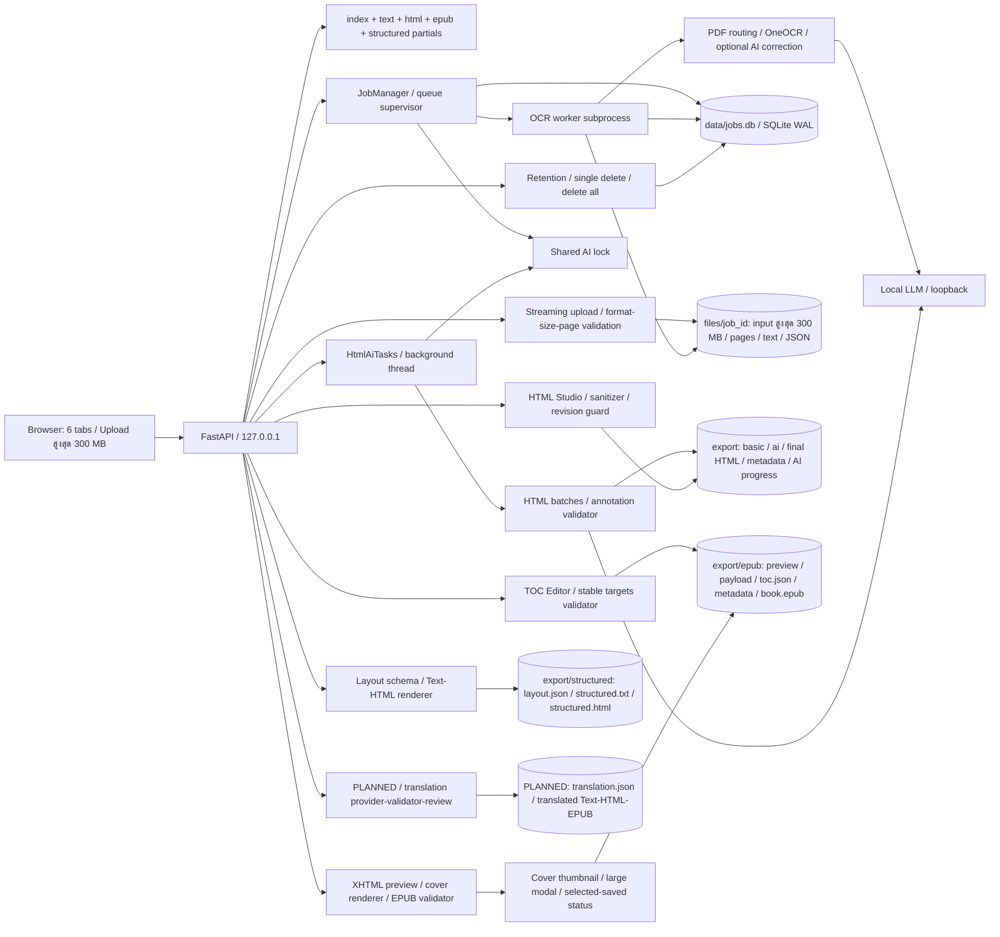
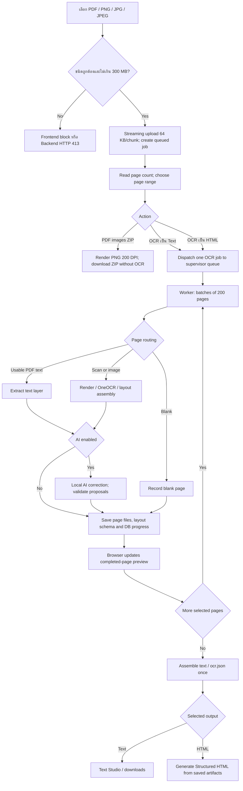
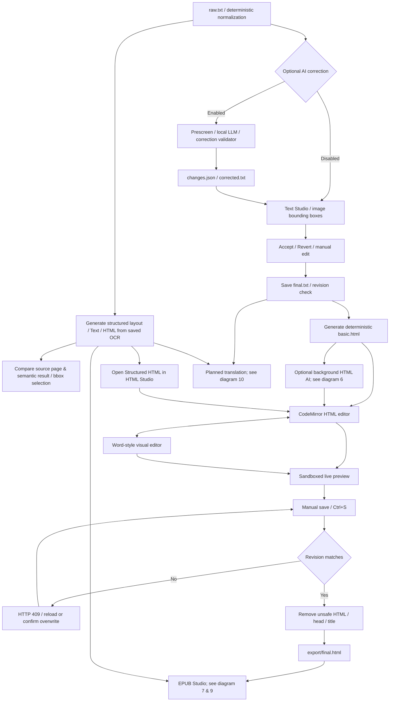
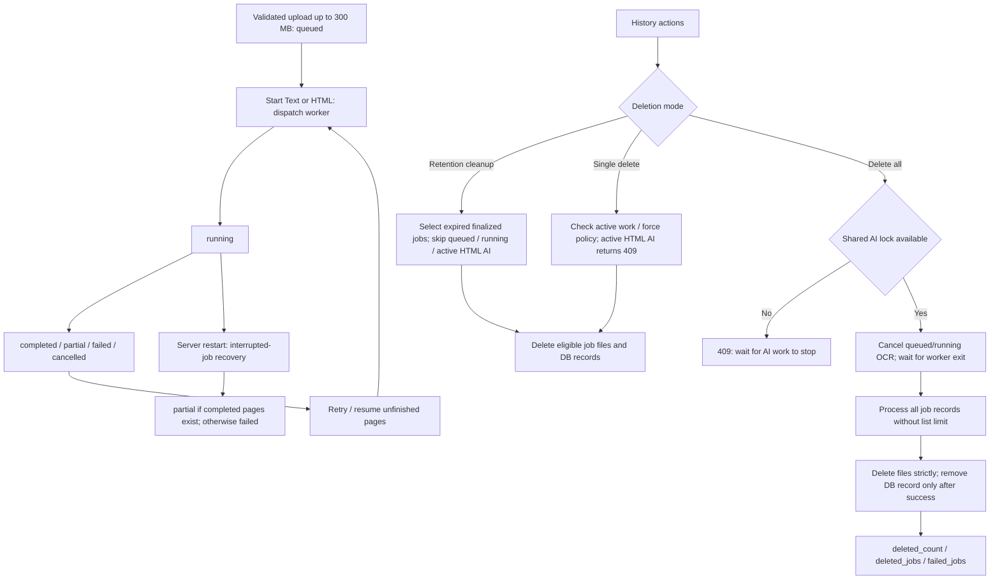
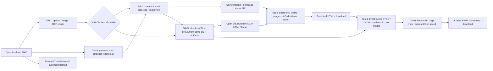
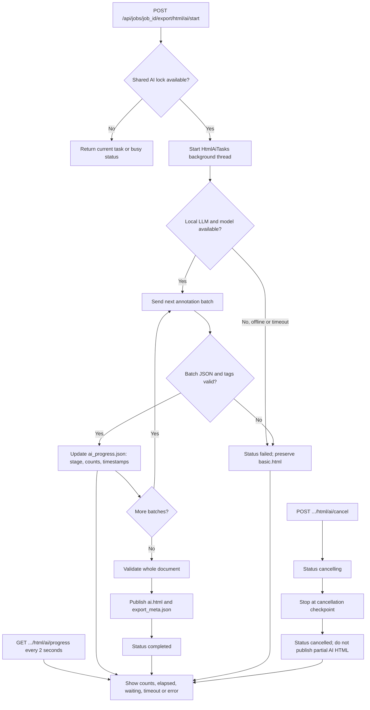
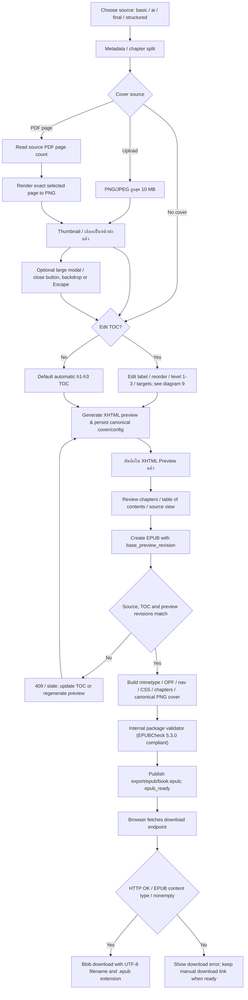
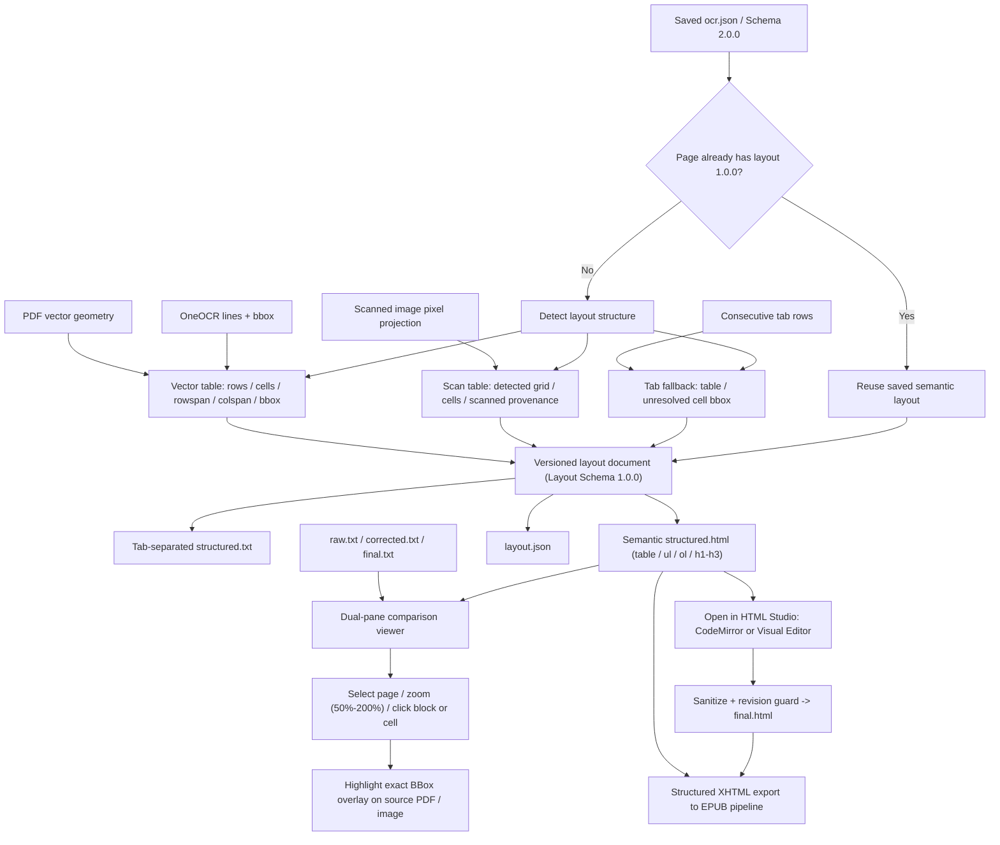
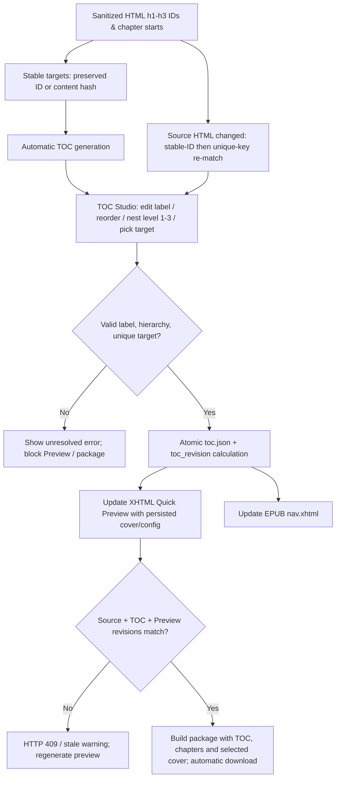
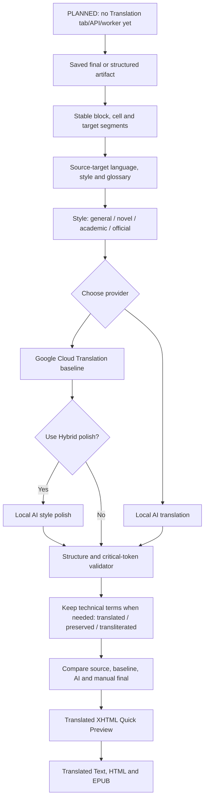

# Local Thai OCR Web

[-0078D6.svg?logo=windows)](https://microsoft.com)
[-3776AB.svg?logo=python)](https://python.org)
[](https://fastapi.tiangolo.com)
[-critical.svg)](#จุดเด่นของระบบ-key-features)
[](#การตั้งค่า-local-ai-ตรวจแก้)
[](#จุดเด่นของระบบ-key-features)

เว็บแอปพลิเคชันสำหรับแปลงเอกสาร **PDF และภาพภาษาไทยเป็นข้อความ UTF-8** ขับเคลื่อนด้วย **OneOCR** (เอนจิน OCR ภาษาไทยแบบเนทีฟจาก Windows 11 Snipping Tool ผ่าน Python `ctypes`) พร้อมระบบจัดลำดับข้อความอัจฉริยะ (Smart Layout Assembly) และผสานพลัง **Local AI (LLM/VLM)** ช่วยตรวจแก้คำผิด สระ และวรรณยุกต์ โดยประมวลผล **ภายในเครื่อง 100% (Localhost Single-User)** โดยไม่ส่งข้อมูลออกนอกเครื่อง พร้อมหน้าเว็บ **Web Studio** สำหรับตรวจทาน เทียบภาพต้นฉบับ แก้ไข และส่งออกไฟล์

> [!IMPORTANT]
> ระบบรองรับ Windows 10/11 แบบ 64-bit เท่านั้น เพราะใช้ OneOCR DLL แบบ 64-bit และออกแบบให้ใช้งานจาก `127.0.0.1` บนเครื่องเดียว

## เริ่มใช้งานด่วนจาก GitHub

หลัง clone repository แล้ว ให้เปิด Command Prompt ที่โฟลเดอร์โครงการและรัน:

```cmd
.\publish\run_server.cmd
```

สคริปต์จะสร้าง `publish\venv` และติดตั้ง dependencies ให้เองในครั้งแรก จากนั้นเปิด [http://127.0.0.1:8000/](http://127.0.0.1:8000/) ในเบราว์เซอร์

หยุด server:

```cmd
.\publish\stop_server.cmd
```


### โหมด OCR และ Local AI

- ค่าเริ่มต้นคือ **OneOCR อย่างเดียว (Baseline)** จึงใช้งาน OCR ได้แม้ไม่ได้เปิด Local LLM
- อัปโหลดเอกสาร PDF/PNG/JPG/JPEG ได้สูงสุด **300 MB ต่อไฟล์**; Backend อ่านข้อมูลแบบ streaming และตอบ HTTP 413 เมื่อเกินเพดาน
- เลือกช่วงหน้าเริ่มต้น–สิ้นสุดได้ตามจำนวนหน้าของเอกสาร; ระบบแบ่งทำงานเป็น **batch ละ 200 หน้า** ต่อเนื่องจนจบช่วงที่เลือก
- ก่อนเริ่มงานเลือกได้ว่าจะใส่หัวข้อเลขหน้า เช่น `--- Page 1 ---` ในไฟล์ข้อความรวม (`raw.txt`, `corrected.txt`, `final.txt`) หรือไม่; ค่าเริ่มต้นคือใส่
- เลือก PDF แล้วระบบจะอัปโหลดและตรวจจำนวนหน้าทันที; งานที่ยกเลิกสามารถเริ่มต่อเฉพาะหน้าที่ยังไม่เสร็จได้
- หลังตรวจจำนวนหน้า หน้า Upload จะแสดง `OCR เป็น Text` และ `OCR เป็น HTML`; ทั้งสองทาง OCR เพียงครั้งเดียว โดยตัวเลือก HTML สร้าง Structured HTML จาก artifact เดิมแล้วเปิดหน้าตรวจผลอัตโนมัติ
- หน้า Structured OCR มีปุ่ม `เปิดใน HTML Studio` เพื่อแก้ Structured HTML ผ่าน CodeMirror หรือ Visual Editor; เมื่อบันทึกจะสร้าง `final.html` ผ่าน sanitizer และ revision guard โดยรักษา table/block/cell mapping
- เมื่อ OCR แต่ละหน้าเสร็จ หน้า Preview จะเปลี่ยนไปแสดงภาพและข้อความของหน้านั้นทันที
- เมื่อ Local AI เป็น Offline ระบบจะล็อก **OneOCR + Local AI ตรวจแก้คำ** ไว้
- กด **ทดสอบการเชื่อมต่อ** ข้างสถานะ Local AI; เมื่อเชื่อมต่อและพบโมเดลแล้ว ตัวเลือก AI จะถูกปลดล็อก

---

## สารบัญ

- [เริ่มใช้งานด่วนจาก GitHub](#เริ่มใช้งานด่วนจาก-github)
- [จุดเด่นของระบบ (Key Features)](#จุดเด่นของระบบ-key-features)
- [สถาปัตยกรรมและแผนภาพการทำงาน (Architecture & Diagrams)](#สถาปัตยกรรมและแผนภาพการทำงาน-architecture--diagrams)
  - [1. สถาปัตยกรรมระบบ](#1-สถาปัตยกรรมระบบ)
  - [2. OCR และการจัดเส้นทางเอกสาร](#2-ocr-และการจัดเส้นทางเอกสาร)
  - [3. การตรวจทานข้อความและ HTML Studio](#3-การตรวจทานข้อความและ-html-studio)
  - [4. สถานะ OCR และการลบงาน](#4-สถานะ-ocr-และการลบงาน)
  - [5. ขั้นตอนใช้งานบนหน้าเว็บ](#5-ขั้นตอนใช้งานบนหน้าเว็บ)
  - [6. HTML AI เบื้องหลังและ progress](#6-html-ai-เบื้องหลังและ-progress)
  - [7. EPUB preview, package และดาวน์โหลด](#7-epub-preview-package-และดาวน์โหลด)
  - [8. Structured OCR และหน้าตรวจเทียบ](#8-structured-ocr-และหน้าตรวจเทียบ)
  - [9. Editable TOC และ stable targets](#9-editable-toc-และ-stable-targets)
  - [10. งานแปลเอกสารที่กำลังวางแผน](#10-งานแปลเอกสารที่กำลังวางแผน)
- [การติดตั้งและเริ่มต้นใช้งาน (Getting Started)](#การติดตั้งและเริ่มต้นใช้งาน-getting-started)
  - [ความต้องการของระบบ](#ความต้องการของระบบ-prerequisites)
  - [วิธีที่ 1: รันด่วนด้วยชุดติดตั้งพร้อมแจกจ่าย (`publish/`)](#วิธีที่-1-รันด่วนด้วยชุดติดตั้งพร้อมแจกจ่าย-publish)
  - [วิธีที่ 2: ติดตั้งจาก Source Code สำหรับนักพัฒนา](#วิธีที่-2-ติดตั้งจาก-source-code-สำหรับนักพัฒนา)
- [การตั้งค่า Local AI ตรวจแก้](#การตั้งค่า-local-ai-ตรวจแก้)
- [สัญญาข้อมูลและไฟล์ผลลัพธ์ (Data Contract)](#สัญญาข้อมูลและไฟล์ผลลัพธ์-data-contract)
- [รายละเอียด REST API (API Reference)](#รายละเอียด-rest-api-api-reference)
- [โครงสร้างโฟลเดอร์ (Repository Structure)](#โครงสร้างโฟลเดอร์-repository-structure)
- [ผลการทดสอบและเกณฑ์ตรวจรับ (Verification & Benchmarks)](#ผลการทดสอบและเกณฑ์ตรวจรับ-verification--benchmarks)
- [สถานะปัจจุบันและงานถัดไป](#สถานะปัจจุบันและงานถัดไป)
- [การแก้ปัญหาล่าสุด](#การแก้ปัญหาล่าสุด)
- [ข้อควรรู้ก่อนเผยแพร่บน GitHub](#ข้อควรรู้ก่อนเผยแพร่บน-github)
- [สิทธิ์การใช้งานและข้อจำกัดความรับผิดชอบ (License & Disclaimer)](#สิทธิ์การใช้งานและข้อจำกัดความรับผิดชอบ-license--disclaimer)

---

## จุดเด่นของระบบ (Key Features)

1. **OneOCR ภาษาไทยแท้ (High Accuracy OCR):**
   - โหลดโมเดล `oneocr.dll` และ `oneocr.onemodel` ผ่าน Python `ctypes` โดยตรง ไม่ต้องติดตั้งโปรแกรม C++ เพิ่มเติม
   - อัตราความผิดพลาดต่ำมาก (**CER 0.04%** บนเอกสารไทยตัวพิมพ์ชัด และ **CER รวม 0.83%** บนชุดตรวจรับ)
2. **Hybrid PDF Pipeline (ตรวจจับและจัดเส้นทางอัจฉริยะ):**
   - แยกแยะหน้าเอกสารอัตโนมัติ: ดึง Text Layer ตรงจาก Digital PDF ที่สมบูรณ์ หรือเรนเดอร์ภาพความละเอียดสูงเพื่อทำ OCR สำหรับหน้าสแกน/ภาพ
   - ตรวจจับหน้าว่างจริง (`blank`) ไม่ทิ้งหน้าและไม่แสดงเป็นข้อความว่างลึกลับ
3. **Interactive Dual-Pane Web Studio:**
   - หน้าจอทำงานแบบแยก 2 ฝั่ง (ต้นฉบับ vs ข้อความที่แปลงได้)
   - **Bidirectional Bounding Box Sync:** คลิกคำ/บรรทัดบนข้อความ กรอบสีบนภาพต้นฉบับจะเลื่อนและไฮไลต์ตำแหน่งทันที และสามารถคลิกกรอบบนภาพเพื่อวิ่งไปยังข้อความได้เช่นกัน
   - แสดงหน้า Preview ที่เพิ่ง OCR เสร็จระหว่างงานทำงาน โดยไม่สลับหน้าหากมีข้อความแก้มือที่ยังไม่บันทึก
4. **Local AI Correction & Diff Engine:**
   - เริ่มต้นเป็น OneOCR only; เปิด AI ได้เมื่อทดสอบการเชื่อมต่อ Local LLM ผ่านแล้ว
   - ใช้กฎ deterministic สำหรับ OCR ที่แยก `ำ` เป็น ` า` หรือ ` ้า` ก่อนส่งคำที่เหลือให้ Local LLM เสนอการแก้
   - ปุ่ม **AI ตรวจคำผิดทั้งหมด** อ่าน `raw.txt` ของทุกหน้าที่ OCR สำเร็จแล้ว โดยไม่ทำ OCR ซ้ำ และเก็บผลเป็นข้อเสนอ
   - ปุ่ม **Accept / Revert** ทีละจุด หรือทั้งหมด พร้อมการันตีคืนค่า raw text byte-for-byte ได้ 100%
5. **Crash Isolation & Resilient Architecture:**
   - แยก **FastAPI Web Server** ออกจาก **OCR Worker Subprocess** อย่างเด็ดขาด ป้องกัน Native DLL Crash ไม่ให้เซิร์ฟเวอร์หลักหยุดทำงาน
   - จัดการคิวงานด้วย SQLite โหมด Write-Ahead Logging (WAL) พร้อมกู้คืนงานที่ค้าง (`recovering interrupted jobs`) หลังเปิดระบบใหม่
   - กลไกป้องกันการแก้ไขชนกันหลายแท็บ (Multi-tab Conflict Detection ด้วย ETag/Revision คืนค่า HTTP 409)
6. **Data Retention & Anti-Resurrection:**
   - หน้า **งาน OCR ก่อนหน้า** เปิดดู ดาวน์โหลด หรือลบงานทีละรายการได้ และลบงานที่เก่ากว่าจำนวนวันที่ผู้ใช้กำหนดได้; **ลบงานทั้งหมด** ยกเลิก OCR ที่ค้างแล้วลบทุกงาน พร้อมรายงานงานที่ลบไม่สำเร็จ
   - ป้องกันสภาวะ Race Condition: หากงานถูกลบไปแล้ว Worker จะยุติการเขียนไฟล์กลับคืนทันที (0 Resurrection)
7. **ความเป็นส่วนตัวและ Offline 100% สำหรับฟีเจอร์ที่ใช้งานได้ปัจจุบัน:**
   - เซิร์ฟเวอร์ผูกเข้ากับ `127.0.0.1` (Loopback Only) ปฏิเสธการเข้าถึงจาก IP ภายนอกด้วย HTTP 403 Forbidden
   - ประมวลผลและเก็บข้อมูลบนเครื่องของผู้ใช้เท่านั้น ไม่ส่งข้อมูลใด ๆ ออกนอกเครือข่าย
8. **ส่งออกผลลัพธ์และภาพ PDF:**
   - ดาวน์โหลด `raw.txt`, `corrected.txt`, `final.txt` และ ZIP ผลลัพธ์ได้ แม้งานถูกยกเลิก โดยระบบคงข้อความหน้าที่ทำสำเร็จแล้วไว้
   - สำหรับไฟล์ PDF สามารถกด **"ดาวน์โหลดภาพแต่ละหน้า (ZIP)"** ได้ทันทีในแท็บอัปโหลดเอกสาร (PNG 200 DPI ตามช่วงหน้าที่เลือก) โดยไม่ต้องสั่งเริ่มทำ OCR
9. **EPUB 3 Export, XHTML Quick Preview และ Editable TOC Editor:**
   - เลือก `basic.html`, `ai.html`, `final.html` หรือ `structured.html` เป็นฐาน แล้วตรวจ XHTML Quick Preview พร้อมโครงสร้างสารบัญก่อนสร้างไฟล์ `.epub`; เมื่อสร้างสำเร็จเบราว์เซอร์ดาวน์โหลดอัตโนมัติ
   - EPUB 3 แบบ reflowable มีสารบัญ, metadata, CSS ภาษาไทยภายในไฟล์, ระบบตรวจจับ stale revision และ internal package validator (สอดคล้องกับ EPUBCheck 5.3.0) ตรวจสอบความถูกต้อง
   - **EPUB Cover:** เลือกได้ 2 แบบ: อัปโหลด PNG/JPEG สูงสุด 10 MB หรือนำหน้าใดหน้าหนึ่งของ PDF ต้นฉบับมาแปลงเป็นรูปปก แสดง Thumbnail ที่กดดูภาพขนาดใหญ่ได้ และแยกสถานะ `เลือกเป็นหน้าปกแล้ว` ออกจาก `บันทึกใน XHTML Preview แล้ว`
   - **Editable TOC & Stable Targets:** สตูดิโอแก้ไขสารบัญ EPUB ปรับแต่งชื่อ (Label), สลับลำดับ (Reorder), จัดโครงสร้างชั้นลำดับ (Level 1–3), เลือกลิงก์ปลายทาง (Target) จากต้นบทหรือหัวข้อ h1–h3 พร้อม stable target ID ป้องกันลิงก์เลื่อนหลุด และระบบ Re-match อัตโนมัติเมื่อเนื้อหา HTML เปลี่ยนแปลง
10. **Minimal Web Studio และ Visual Editor แบบ Word:**
    - Light theme เป็นค่าเริ่มต้น สลับ Dark ได้ พร้อม icon ปุ่ม, focus state และ responsive layout
    - แยกพื้นที่ทำงานเป็น 6 แท็บอิสระ: **อัปโหลดเอกสาร**, **ผลข้อความ**, **HTML**, **ส่งออก EPUB**, **Structured OCR**, และ **งาน OCR ก่อนหน้า**
    - ในแท็บ HTML มีระบบแก้ไขสองโหมด: **CodeMirror 5.65.21** สำหรับแก้ไขโค้ด HTML โดยตรง และ **Visual Editor แบบ Word** (WYSIWYG: ตัวหนา, ตัวเอียง, ขีดเส้นใต้, หัวข้อ H1–H3, รายการจุด/ตัวเลข, ลิงก์, Undo/Redo) พร้อมซิงก์สองฝั่งอัตโนมัติ
    - ระบบบันทึกแบบแมนนวล (Ctrl+S / ปุ่มบันทึก ปราศจาก Autosave) ป้องกันข้อผิดพลาด draft สูญหาย รองรับ Revision Conflict (HTTP 409) และแก้ปัญหา Title leak (`OCR Document - ...`) ไม่ให้ปนเปื้อนลงใน `<body>`
11. **Structured OCR และการตรวจเทียบตำแหน่งต้นฉบับ:**
    - ตรวจจับโครงสร้างตาราง (Vector Geometry ตรวจเส้นจริงจาก PDF และ Scanned Projection ตรวจตารางสแกน) และรายการ (List bullet/numbered)
    - ส่งออกเป็น Structured Text (tab-separated) และ Semantic HTML (table/thead/tbody/tr/th/td, ul/ol/li) จาก `ocr.json` เดิมโดยไม่ต้องรัน OCR หรือ AI ซ้ำ
    - หน้าตรวจเทียบต้นฉบับแบบแยก 2 ฝั่ง (Original vs Text/HTML) พร้อมระบบซูม 50%–200%, ไฮไลต์ Bounding Box อัตโนมัติเมื่อคลิกเซลล์หรือบล็อกข้อความ รองรับทั้งเมาส์ คีย์บอร์ด และอุปกรณ์มือถือ
12. **Document Translation (กำลังวางแผน):**
    - วางแผนให้เลือกภาษาต้นทาง/ปลายทาง, style `ทั่วไป`/`นิยาย`/`วิชาการ`/`ราชการ` และ provider Google/Local AI/Hybrid
    - รักษา segment, ตาราง, TOC, ศัพท์เฉพาะ และ code program พร้อม diff และ human review ก่อนส่งออก Text/HTML/EPUB
    - ยังไม่มี Translation tab/API/worker ในระบบปัจจุบัน และยังไม่ถือเป็นฟีเจอร์พร้อมใช้งาน

---

## สถาปัตยกรรมและแผนภาพการทำงาน (Architecture & Diagrams)

อัปเดตวันที่ 2026-10-09: อัปโหลด PDF/PNG/JPG/JPEG ได้สูงสุด 300 MB, OCR ใช้ subprocess, Structured OCR เปิดแก้ใน HTML Studio ได้ และ EPUB รองรับหน้าปกทั้งไฟล์อัปโหลดกับหน้า PDF ต้นฉบับพร้อมภาพตัวอย่างขนาดใหญ่ งานถัดไปคือ Document Translation ซึ่งยังไม่มี tab/API/worker ใช้งานจริง

### 1. สถาปัตยกรรมระบบ



### 2. OCR และการจัดเส้นทางเอกสาร



งานถูกสร้างตั้งแต่อัปโหลด แต่เริ่ม worker เมื่อกดเริ่มแปลงหน้า แบ่ง OCR ละ 200 หน้าเพื่อคืนทรัพยากรระหว่าง batch; preview ไม่ทับข้อความแก้มือที่ยังไม่บันทึก

### 3. การตรวจทานข้อความและ HTML Studio



ไม่มี Autosave; การสลับ Code/Visual รักษาฉบับร่าง การตรวจคำผิด AI และการจัดหัวข้อ HTML AI เป็นคนละงาน: HTML AI เปลี่ยนเฉพาะ tag ไม่แก้หรือสรุปข้อความ

### 4. สถานะ OCR และการลบงาน



**ลบงานทั้งหมด** ครอบคลุมทุกสถานะ OCR และไม่จำกัด 100 งาน หากลบไฟล์บางงานไม่ได้ จะคง record งานนั้นและรายงาน `failed_jobs` หาก HTML AI ยังทำงาน ต้องยกเลิกและรอให้หยุดก่อน การลบทั้งหมดต่างจาก cleanup ตามอายุ ซึ่งข้ามงาน active

### 5. ขั้นตอนใช้งานบนหน้าเว็บ



### 6. HTML AI เบื้องหลังและ progress



แบ่งไม่เกิน **25 units / prompt เป้าหมาย 5,500 UTF-8 bytes** ต่อ batch โดยใช้ข้อความตัวอย่างไม่เกิน 120 ตัวอักษรต่อ unit และ `max_tokens=1600`, `temperature=0` คืน tag `p`, `h1`, `h2`, `h3`; ข้อความเต็มยังใช้จากต้นฉบับ ตรวจจำนวน/ID ครบ มี `h1` ได้ไม่เกินหนึ่ง และไม่ข้ามระดับหัวข้อก่อนเผยแพร่

LM Studio ที่แจ้ง capability รองรับ `reasoning: off` จะใช้ native `/api/v1/chat` พร้อม `store: false`; server อื่นใช้ OpenAI-compatible API เดิม การตั้งค่านี้ใช้เฉพาะ HTML annotations ไม่เปลี่ยน OCR correction

สถานะ task: `running`, `cancelling`, `completed`, `failed`, `cancelled` และ `idle` เมื่อไม่มีงาน การยกเลิกรอคำขอ batch ปัจจุบันตอบกลับหรือ timeout; refresh เบราว์เซอร์ติดตามงานเดิมได้ แต่ restart server ไม่ resume งาน HTML AI และแจ้งให้ลองใหม่ ไม่มี retry inference อัตโนมัติใน background task

### 7. EPUB preview, package และดาวน์โหลด



กด **สร้างไฟล์ EPUB** แล้วดาวน์โหลดอัตโนมัติ และมีลิงก์ดาวน์โหลดซ้ำ หน้าปกเลือกได้ระหว่างอัปโหลด PNG/JPEG สูงสุด 10 MB, render หน้า PDF ต้นฉบับตามเลขหน้าที่ระบุ หรือสร้างแบบไม่มีปก เมื่อแก้ HTML ต้นทาง สารบัญ หรือหน้าปก ต้องสร้าง preview ใหม่ก่อน package; ไม่เรียก OCR/AI เพิ่มระหว่างสร้าง EPUB

### 8. Structured OCR และหน้าตรวจเทียบ



การส่งออกจาก artifact เดิมไม่เรียก OCR หรือ Local AI เพิ่ม งานที่ไม่มี bbox หรือ glyph ที่ตีความไม่ได้แสดง unresolved ตามจริง รองรับ vector/scanned table, raw/corrected/final, semantic HTML และ structured EPUB พร้อม stale guard ผู้ใช้เปิด Structured HTML ใน HTML Studio เพื่อแก้ด้วย CodeMirror หรือ Visual Editor แล้วบันทึกเป็น `final.html` ได้

### 9. Editable TOC และ stable targets



TOC editor รองรับจัดลำดับและย่อหน้าได้สูงสุด 3 ระดับ เลือกลิงก์ปลายทางจากหัวข้อหรือต้นบท และสร้าง href อัตโนมัติจาก BookModel งานเก่าที่ไม่มี `toc.json` ยังใช้สารบัญอัตโนมัติได้ตามปกติ รูปปกรองรับทั้งการลากวาง PNG/JPEG สูงสุด 10 MB และการเลือกหน้า PDF ต้นฉบับเพื่อแปลงเป็นภาพปก โดยไม่เรียก OCR ซ้ำ

### 10. งานแปลเอกสารที่กำลังวางแผน



diagram นี้เป็นแบบออกแบบของงานถัดไปเท่านั้น ยังไม่มี Translation tab/API/worker ในระบบปัจจุบัน

---

## การติดตั้งและเริ่มต้นใช้งาน (Getting Started)

### ความต้องการของระบบ (Prerequisites)
- **ระบบปฏิบัติการ:** Windows 10 หรือ Windows 11 (แบบ **64-bit** เท่านั้น เนื่องจาก OneOCR DLL เป็น 64-bit)
- **Python:** Python 3.10 ขึ้นไป (64-bit) พร้อม Python Launcher (`py`)
- **เว็บเบราว์เซอร์:** Google Chrome, Microsoft Edge หรือเบราว์เซอร์ Chromium ทันสมัย

---

### วิธีที่ 1: รันด่วนด้วยชุดติดตั้งพร้อมแจกจ่าย (`publish/`)

เหมาะสำหรับการนำไปติดตั้งใช้งานบน Windows เครื่องอื่นทันที โดยในโฟลเดอร์ `publish/` ได้รวบรวมไฟล์ binary, โมเดล, โค้ด และหน้าเว็บไว้อย่างครบถ้วนแล้ว:

1. เปิด **Command Prompt** ในโฟลเดอร์ `publish/`
2. รันสคริปต์ติดตั้งระบบ (จะสร้าง virtual environment และดาวน์โหลด dependencies อัตโนมัติ):
   ```cmd
   .\install.cmd
   ```
3. เริ่มต้นเซิร์ฟเวอร์:
   ```cmd
   .\run_server.cmd
   ```
4. เปิดเบราว์เซอร์ไปที่: **`http://127.0.0.1:8000/`**

---

### วิธีที่ 2: ติดตั้งจาก Source Code สำหรับนักพัฒนา

หากต้องการพัฒนาต่อ ปรับแต่ง หรือรันชุดทดสอบ (Tests):

1. **ตรวจสอบโฟลเดอร์โมเดล OneOCR:**  
   ตรวจสอบว่ามีไฟล์ binary ครบถ้วนในโฟลเดอร์ `oneOCR/`:
   ```text
   oneOCR/
   ├── oneocr.dll        (DLL เอนจิน OneOCR)
   ├── oneocr.onemodel   (โมเดล ONNX สำหรับภาษาไทย/อังกฤษ)
   └── onnxruntime.dll   (ONNX Runtime 64-bit)
   ```

2. **สร้าง Virtual Environment และเปิดใช้งาน:**
   ```powershell
   py -3 -m venv venv
   .\venv\Scripts\Activate.ps1
   ```

3. **ติดตั้ง Dependencies:**
   ```powershell
   python -m pip install --upgrade pip
   python -m pip install -r publish/requirements.txt
   ```

4. **เตรียมไฟล์การตั้งค่า (`.env`):**
   ```powershell
   Copy-Item .env.example .env
   ```

5. **ทดสอบความพร้อมของ OneOCR (Smoke Test):**
   ```powershell
   python tests/smoke_test_oneocr.py
   ```
   *หากผ่านจะแสดงข้อความ `Final Smoke Test Verdict: PASS`*

6. **เริ่มการทำงานของเซิร์ฟเวอร์:**
   ```powershell
   python -m uvicorn src.server:app --host 127.0.0.1 --port 8000 --reload
   ```

---

## การตั้งค่า Local AI ตรวจแก้

ระบบรองรับการเชื่อมต่อกับ **Local LLM / VLM** ผ่าน OpenAI-compatible API (เช่น [LM Studio](https://lmstudio.ai/) หรือ [Ollama](https://ollama.com/)) โดยมีขั้นตอนดังนี้:

1. เปิดโปรแกรม Local LLM และโหลดโมเดลที่ต้องการ (เช่น `google/gemma-3-1b` หรือโมเดลภาษาไทยอื่น ๆ)
2. เริ่มการทำงานของ Local Server ที่ `http://127.0.0.1:1234/v1`
3. เข้าหน้าเว็บตั้งค่าของระบบ: **`http://127.0.0.1:8000/config.html`**
4. กรอกข้อมูลการเชื่อมต่อ:
   - **Base URL:** `http://127.0.0.1:1234/v1` *(จำกัดเฉพาะ localhost/127.0.0.1 เพื่อความปลอดภัย)*
   - **Model:** ระบุชื่อโมเดล เช่น `google/gemma-3-1b`
   - **Timeout:** ค่าเริ่มต้น `60.0` วินาที
5. กดปุ่ม **"ทดสอบการเชื่อมต่อ"** เมื่อขึ้นสถานะพร้อมใช้งาน ให้กด **"บันทึกการตั้งค่า"**
6. ค่าจะถูกบันทึกลง `.env` และมีผลกับงาน OCR+AI รอบถัดไปทันที

---

### ผลทดสอบ Local LLM: ปัญหาสระ `ำ` จาก OCR

ทดสอบเมื่อ 2026-09-29 ผ่าน Local OpenAI-compatible API ที่ `127.0.0.1:1234` โดยวัดว่าผลแก้ไขตรงกับคำที่คาดหวังและสามารถนำไป apply กับข้อความต้นทางได้จริง ชุดทดสอบมี 13 คำ เช่น `ท างาน` → `ทำงาน`, `น ้าท่วม` → `น้ำท่วม`, `ด าน า` → `ดำนำ`, `ข้าวย า` → `ข้าวยำ` และ `เงื่อนง า` → `เงื่อนงำ`.

| วิธี / โมเดล | ผลถูกต้อง | เวลาโดยประมาณ | ข้อสรุป |
|---|---:|---:|---|
| Baseline deterministic rule | **13/13** | ทันที | ใช้เป็นแนวป้องกันหลักสำหรับรูปแบบ “อักษร + เว้นวรรค + า/วรรณยุกต์+า” |
| `google/gemma-4-e2b` | **10/13** | ~108 วินาที | แก้ `ด าน า` ผิดเป็น `ด้านำ`, `ข าขัน` ผิดเป็น `ข้าขัน`, และ `ข้าวย า` ผิดเป็น `ข้าวยา`; ไม่เหมาะเป็นค่าเริ่มต้น |
| `google/gemma-3-1b` | **0/13** | ~64 วินาที | เสนอ `original_text` ไม่ตรงข้อความต้นทางและแก้คำไม่ถูกต้อง จึง apply ผลจริงไม่ได้ |

`gemma-4-e2b` สร้าง `reasoning_content` ก่อนคำตอบ: เมื่อใช้ `max_tokens=600` คำตอบสุดท้ายว่าง เพราะ reasoning ใช้ token หมด; การทดสอบข้างต้นจึงใช้ `max_tokens=1600` และพบ reasoning 685 token. ระบบจึงยังคงใช้กฎ deterministic กับปัญหาสระ `ำ` และให้ Local LLM เสนอการแก้กรณีอื่นเพื่อให้ผู้ใช้ตรวจทานก่อนยอมรับ

#### ตรวจสอบผลของ Prompt กับ `google/gemma-3-1b`

ทดสอบเพิ่มเมื่อ 2026-09-29 ผ่าน API เดิม โดยใช้ `temperature=0` และ `max_tokens=800` เพื่อแยกปัญหา prompt ออกจากการเชื่อมต่อโมเดล ผลพบว่า prompt มีผลต่อรูปแบบคำตอบ แต่โมเดลยังไม่เสถียรกับการประกอบอักขระไทยและ Structured JSON จึงไม่ใช่สาเหตุเดียวของผล 0/13.

| ชุดทดลอง | Prompt ที่ใช้ | ผลตอบกลับ | สรุป |
|---|---|---|---|
| Prompt ระบบปัจจุบัน + 12 คำ | `You are a Thai OCR correction engine. Return only valid JSON ... Do not romanize Thai.` และ `Correct only OCR spelling mistakes ... original_text must be copied exactly from the input.` | ส่ง fenced JSON ที่มี object ราก 2 ตัว; `original_text` ตัดช่องว่างและ `corrected_text` ไม่แก้เป็น `ำ` | JSON ใช้ไม่ได้และไม่ผ่าน validator |
| Prompt ไทยแบบ few-shot + 12 คำ | `ตัวอย่าง: ข้อความ \`ท างาน\` -> {"corrections":[{"original_text":"ท างาน","corrected_text":"ทำงาน"}]}` แล้วสั่งให้แก้รูปแบบอักษร+ช่องว่าง+า โดยคัดลอก `original_text` ตรงตัว | แก้ `ท างาน` → `ทำงาน` ได้ แต่ตอบเพียง 1 รายการจาก 12 | few-shot ช่วยเฉพาะกรณีตัวอย่าง แต่ไม่รองรับงานหลายรายการ |
| คำถามเดี่ยว | `ข้อความ OCR คือ \`ผู้อ านวยการ\` คำที่ถูกต้องคืออะไร? ตอบเฉพาะคำไทยหนึ่งคำ ห้ามอธิบาย ห้ามใช้อักษรอังกฤษ` | `ผู้อานวยการ` | ยังลบช่องว่างแต่ไม่สร้าง `ำ` |
| คำถามสั้น | `รวม \`ท างาน\` ให้เป็นคำไทยที่ถูกต้อง แล้วตอบเฉพาะผลลัพธ์` | ตอบเป็นรายการคำหลายคำ เช่น `การทำงาน`, `การทำหน้าที่` | ไม่ทำตามรูปแบบผลลัพธ์และมีการแต่งเติม |

ข้อความ prompt เต็มของชุด few-shot ที่ให้ผลดีที่สุดในการทดสอบนี้:

```text
ตอบ JSON เท่านั้น ห้ามอธิบาย ห้ามแปลไทยเป็นอักษรโรมัน

ตัวอย่าง: ข้อความ `ท างาน` -> {"corrections":[{"original_text":"ท างาน","corrected_text":"ทำงาน"}]}

จงแก้เฉพาะช่องว่างที่ทำให้สระ ำ กลายเป็น อักษร+ช่องว่าง+า ในรายการนี้ โดยคัดลอก original_text ตรงตัว:
ท างาน
ผู้อ านวยการ
ส ารวจ
ก าลัง
น ้าท่วม
น าเกลือ
ด าน า
ข าขัน
ค าพูด
ข้าวย า
ล าน ้า
เงื่อนง า
```

ข้อความ prompt อื่นที่ใช้ในการทดสอบ (รายการ 12 คำใช้ชุดเดียวกับด้านบน):

```text
[system]
You are a Thai OCR correction engine. Return only valid JSON:
{"corrections":[{"original_text":"exact substring","corrected_text":"corrected Thai","category":"spelling","reason":"short"}]}
Do not romanize Thai.

[user]
Correct only OCR spelling mistakes in this text. original_text must be copied exactly from the input.
<รายการ 12 คำด้านบน>

[single question]
ข้อความ OCR คือ `ผู้อ านวยการ`
คำที่ถูกต้องคืออะไร? ตอบเฉพาะคำไทยหนึ่งคำ ห้ามอธิบาย ห้ามใช้อักษรอังกฤษ

[short question]
รวม `ท างาน` ให้เป็นคำไทยที่ถูกต้อง แล้วตอบเฉพาะผลลัพธ์
```

ดังนั้นระบบใช้กฎ deterministic ที่ตรวจสอบได้สำหรับรูปแบบนี้ต่อไป; Local LLM ใช้เสนอการแก้กรณีอื่นเท่านั้น และทุกผลต้องผ่าน validator ก่อนนำไปใช้

---

## สัญญาข้อมูลและไฟล์ผลลัพธ์ (Data Contract)

ไฟล์ต้นฉบับและผลลัพธ์ของแต่ละงานจะถูกจัดเก็บแยกตามโฟลเดอร์ใน `files/{job_id}/`:

| ชื่อไฟล์ | คำอธิบายและเนื้อหา |
|---|---|
| **`raw.txt`** | ข้อความดิบที่ประกอบตามลำดับอ่านที่ได้จาก PDF Text หรือ OneOCR ก่อนผ่าน AI |
| **`corrected.txt`** | ข้อความหลังผ่าน Local AI ตรวจแก้ตามโครงสร้าง JSON (มีเฉพาะเมื่อเปิดโหมด AI) |
| **`final.txt`** | ข้อความฉบับทำงานล่าสุดที่ผู้ใช้แก้ไข หรือยอมรับข้อเสนอผ่านหน้าเว็บ |
| **`ocr.json`** | ข้อมูลเชิงลึกของทุกหน้า: บล็อกข้อความ, พิกัด Bounding Box 4 จุด, เส้นทางที่ใช้ (Routing) และสถานะ |
| **`changes.json`** | รายการข้อเสนอการแก้ไขของ AI: ข้อความเดิม, ข้อความใหม่, ตำแหน่งออฟเซ็ต และสถานะ (`pending`, `accepted`, `reverted`) |
| **`page-images.zip`** | สร้างเมื่อขอดาวน์โหลดภาพ PDF; ภายในมี PNG หนึ่งไฟล์ต่อหนึ่งหน้าตามช่วงงาน เช่น `page_0001.png` ที่ 200 DPI |
| **`export/basic.html`, `export/ai.html`, `export/final.html`** | HTML deterministic, AI annotations ที่ผ่าน validator และฉบับแก้มือ |
| **`export/export_meta.json`** | mode, source revision, validation, จำนวน batch และ error |
| **`export/ai_progress.json`** | task status, stage, เวลา, จำนวน batch และเหตุขัดข้อง |
| **`export/structured/layout.json`** | เอกสารโครงสร้าง Layout Schema 1.0.0 (blocks, tables, rows, cells, lists, bboxes, provenance) |
| **`export/structured/structured.txt`** | ข้อความคงโครงสร้างตารางแบบ Tab-separated สำหรับนำไปเปิดใน Spreadsheet / Excel |
| **`export/structured/structured.html`** | HTML โครงสร้างแท้ (table, ul, ol, h1-h3) พร้อม Sandboxed Preview |
| **`export/epub/cover.png`** | รูปปกหนังสือที่ผ่านการประมวลผลและ sanitize แล้ว |
| **`export/epub/preview.xhtml`** | XHTML Quick Preview ที่สร้างก่อน package ใช้ sandbox และ CSP |
| **`export/epub/preview_payload.json`** | canonical payload ของบท, metadata, source revision และ preview revision ที่ใช้สร้าง EPUB |
| **`export/epub/toc.json`** | สารบัญแก้มือ schema 9.0 พร้อม source/TOC revision และ stable target identity |
| **`export/epub/book.epub`** | EPUB แบบ reflowable ที่ผ่าน structural validator ภายในระบบ |
| **`export/epub/epub_meta.json`** | สถานะ EPUB, source/TOC/preview revision, hash, validation result และขนาดไฟล์ |

---

## รายละเอียด REST API (API Reference)

ระบบขับเคลื่อนด้วย **FastAPI** รันบน `http://127.0.0.1:8000` (จำกัดเฉพาะ Loopback เพื่อความเป็นส่วนตัว) มีระบบเอกสาร API แบบ Interactive ให้อัตโนมัติ:

- **Swagger UI**: [http://127.0.0.1:8000/docs](http://127.0.0.1:8000/docs)
- **ReDoc**: [http://127.0.0.1:8000/redoc](http://127.0.0.1:8000/redoc)
- **OpenAPI Schema**: [http://127.0.0.1:8000/openapi.json](http://127.0.0.1:8000/openapi.json)

### 1. หมวดตรวจสุขภาพและสถานะระบบ (Health & Diagnostics)

| Method | Endpoint | คำอธิบาย |
|---|---|---|
| `GET` | `/api/health` | ตรวจสอบสถานะเซิร์ฟเวอร์ ข้อมูลคิวงาน (`queue_info`) และการเชื่อมต่อฐานข้อมูล |

### 2. หมวดตั้งค่า Local AI (Local LLM Configuration)

| Method | Endpoint | พารามิเตอร์ / Body | คำอธิบาย |
|---|---|---|---|
| `GET` | `/api/ai/status` | - | ตรวจสอบว่า Local LLM พร้อมใช้งานหรือไม่ (`healthy` / `offline`) |
| `GET` | `/api/ai/config` | - | ดึงค่าคอนฟิกปัจจุบัน (`base_url`, `model`, `timeout`) โดยซ่อน API Key |
| `POST` | `/api/ai/config/test` | JSON: `{ base_url, model, timeout, api_key? }` | ทดสอบเชื่อมต่อไปยัง endpoint โดยยังไม่บันทึก |
| `PUT` | `/api/ai/config` | JSON: `{ base_url, model, timeout, api_key? }` | บันทึกการตั้งค่าลง `.env` และมีผลกับงานถัดไปทันที |

### 3. หมวดจัดการวงจรงาน OCR (Job Lifecycle)

| Method | Endpoint | พารามิเตอร์ / Body | คำอธิบาย |
|---|---|---|---|
| `POST` | `/api/upload` | Multipart/form-data:<br>• `file`: ไฟล์ PDF / รูปภาพ สูงสุด 300 MB<br>• `max_pages_limit`: (optional)<br>• `max_size_limit`: (optional; ลดเพดานลงได้) | อัปโหลดแบบ streaming และตรวจสอบไฟล์ ตรวจสอบความปลอดภัย สร้าง `job_id`; เกินเพดานคืน 413 |
| `POST` | `/api/jobs/{job_id}/start` | JSON: `{ enable_ai: true, page_start?: 1, page_end?: N, include_page_numbers?: true }` | นำงานเข้าคิวประมวลผล OneOCR / Local AI |
| `GET` | `/api/jobs/{job_id}/status` | Path: `job_id` | เช็คสถานะงานโดยละเอียดระดับหน้าและ latency |
| `POST` | `/api/jobs/{job_id}/cancel` | Path: `job_id` | ยกเลิกงานที่กำลังรันหรือรอคิว พร้อมหยุด Worker ทันที |
| `POST` | `/api/jobs/{job_id}/retry` | JSON: `{ retry_mode: "failed_only" \| "ai_only" \| "full" \| "full_text_ai" }` | ประมวลผลซ้ำเฉพาะหน้าที่ล้มเหลว หรือรันซ้ำเฉพาะ AI |
| `GET` | `/api/jobs` | Query: `limit=50` | ดึงรายการประวัติงานทั้งหมดในฐานข้อมูล SQLite |
| `POST` | `/api/jobs/{job_id}/review` | Query: `new_status=unreviewed \| in_review \| reviewed` | อัปเดตสถานะการตรวจทานของงาน |

### 4. หมวดดูเนื้อหาและตรวจแก้รายหน้า (Page Data & Human-in-the-Loop)

| Method | Endpoint | พารามิเตอร์ / Body | คำอธิบาย |
|---|---|---|---|
| `GET` | `/api/jobs/{job_id}/pages/{page_id}/image` | Path: `job_id`, `page_id` | ดึงรูปภาพเรนเดอร์ของหน้านั้นสำหรับแสดงใน Dual-pane Viewer |
| `GET` | `/api/jobs/{job_id}/pages/{page_id}/data` | Path: `job_id`, `page_id` | ข้อมูลเต็มของหน้า: `raw_text`, `corrected_text`, `final_text`, Bounding boxes, AI proposals |
| `PUT` | `/api/jobs/{job_id}/pages/{page_id}/edit` | JSON: `{ source_revision: int, edited_text: string, check_conflict: bool }` | บันทึกข้อความที่ผู้ใช้แก้ไขเอง ป้องกันการเขียนทับชนกัน (HTTP 409) |
| `POST` | `/api/jobs/{job_id}/pages/{page_id}/corrections/{change_id}/accept` | Path: `change_id` | ยอมรับข้อเสนอแก้คำผิดจุดนั้นของ AI |
| `POST` | `/api/jobs/{job_id}/pages/{page_id}/corrections/{change_id}/revert` | Path: `change_id` | ปฏิเสธข้อเสนอ AI และย้อนกลับไปใช้ข้อความเดิมจาก OCR |
| `POST` | `/api/jobs/{job_id}/pages/{page_id}/corrections/accept-all` | Query: `source_revision?` | ยอมรับข้อเสนอของ AI ทุกจุดในหน้านั้นพร้อมกัน |
| `POST` | `/api/jobs/{job_id}/pages/{page_id}/corrections/revert-all` | Query: `source_revision?` | ปฏิเสธและย้อนคืนข้อความเดิมจาก OCR ทุกจุดในหน้านั้น |

### 5. หมวดดาวน์โหลดผลลัพธ์ (Download & Artifacts)

| Method | Endpoint | ไฟล์ที่รองรับ | คำอธิบาย |
|---|---|---|---|
| `GET` | `/api/jobs/{job_id}/download/{file_type}` | `raw.txt`<br>`corrected.txt`<br>`final.txt`<br>`ocr.json`<br>`changes.json`<br>`bundle.zip`<br>`page-images.zip` | ดาวน์โหลดไฟล์ผลลัพธ์ตามประเภทที่ต้องการ (กรณีงานสถานะ `partial` หรือ `failed` จะมี `X-Job-Warning` แจ้งเตือนใน Header) |

### 6. หมวดส่งออกโครงสร้าง HTML (Structured HTML Export)

| Method | Endpoint | พารามิเตอร์ / Body | คำอธิบาย |
|---|---|---|---|
| `POST` | `/api/jobs/{job_id}/export/html` | JSON: `{ mode: "basic" \| "ai" }` | API synchronous เดิมสำหรับ compatibility; หน้าเว็บ AI ใช้ `/ai/start` (`basic` = deterministic, `ai` = ใช้ AI จัดโครงสร้างหัวข้อ/ย่อหน้า) |
| `POST` | `/api/jobs/{job_id}/export/html/ai/start` | Path: `job_id` | เริ่ม background task; HTTP 202, shared AI lock และ reuse task เดิม |
| `GET` | `/api/jobs/{job_id}/export/html/ai/progress` | Path: `job_id` | progress, stage, counts, elapsed/waiting, timeout และ error; no-store |
| `POST` | `/api/jobs/{job_id}/export/html/ai/cancel` | Path: `job_id` | ขอหยุดแบบ cooperative; รอ batch ปัจจุบัน |
| `GET` | `/api/jobs/{job_id}/export/html/status` | Path: `job_id` | ตรวจสอบสถานะการแปลง HTML และ revision ว่าล้าสมัย (stale) หรือไม่ |
| `GET` | `/api/jobs/{job_id}/export/html/{variant}` | Path: `variant` = `basic` \| `ai` \| `final` | ดาวน์โหลดไฟล์ HTML โครงสร้าง (RFC 5987 UTF-8 attachment) |
| `GET` | `/api/jobs/{job_id}/export/html/{variant}/preview` | Path: `variant` = `basic` \| `ai` \| `final` | ดูตัวอย่าง HTML แบบ Sandboxed CSP ปลอดภัย |
| `PUT` | `/api/jobs/{job_id}/export/html/final` | JSON: `{ html_content, base_revision?, overwrite: bool }` | บันทึกการแก้ไขโค้ด HTML ฉบับสุดท้ายด้วยตนเอง (HTTP 409 หากชน) |

HTML export ใช้ฟอนต์ระบบในเครื่องและไม่โหลด Google Fonts หรือทรัพยากรภายนอก. โหมด `basic` เป็น deterministic; โหมด `ai` ใช้ได้เมื่อ Local LLM พร้อมและถูกจำกัดให้ทำงานพร้อมกับ OCR+AI ได้ครั้งละหนึ่งงาน. การวัดเวลา/VRAM ของ AI และ precision/recall ของ semantic tags จะรายงานต่อเมื่อมีผลวัด Local LLM จริงและเฉลยระดับ element ที่ผู้ตรวจรับรองแล้วเท่านั้น.

### 6.1 หมวดส่งออกโครงสร้างตารางและรายการ (Structured OCR Export)

| Method | Endpoint | พารามิเตอร์ / Body | คำอธิบาย |
|---|---|---|---|
| `POST` | `/api/jobs/{job_id}/export/structured` | Path: `job_id` | สร้างผลลัพธ์ Structured Text / HTML จาก `ocr.json` เดิมโดยไม่รัน OCR/AI ซ้ำ |
| `GET` | `/api/jobs/{job_id}/export/structured/status` | Path: `job_id` | ตรวจสอบสถานะ structured export, ความล้าสมัย (stale) และสถิติโครงสร้าง (ตาราง/เซลล์/รายการ) |
| `GET` | `/api/jobs/{job_id}/export/structured/{variant}` | Path: `variant` = `text` | `html` | `layout` | ดาวน์โหลดไฟล์ `structured.txt`, `structured.html` หรือ `layout.json` |

### 7. หมวดส่งออก EPUB, XHTML Quick Preview และ TOC Editor

| Method | Endpoint | พารามิเตอร์ / Body | คำอธิบาย |
|---|---|---|---|
| `POST` | `/api/jobs/{job_id}/export/epub/preview` | JSON: `{ source_variant, chapter_split, metadata, cover?, toc_revision? }` | สร้าง XHTML Quick Preview โดยยังไม่ package EPUB |
| `GET` | `/api/jobs/{job_id}/export/epub/toc` | Query: `source_variant`, `chapter_split` | อ่าน entries, targets, revision และผล re-match |
| `PUT` | `/api/jobs/{job_id}/export/epub/toc` | JSON: `{ entries, base_source_revision, base_toc_revision, base_preview_revision }` | ตรวจและบันทึกสารบัญแบบ atomic; revision ไม่ตรงคืน 409 |
| `POST` | `/api/jobs/{job_id}/export/epub/toc/regenerate` | JSON: base revisions และ `confirm: true` | สร้างสารบัญอัตโนมัติใหม่โดยยืนยันก่อนทับ |
| `GET` | `/api/jobs/{job_id}/export/epub/cover` | Path: `job_id` | รูปปก PNG ที่ sanitize แล้วผ่าน loopback; nosniff/no-store |
| `GET` | `/api/jobs/{job_id}/export/epub/cover/pdf-pages` | Path: `job_id` | อ่านจำนวนหน้าจาก PDF ต้นฉบับสำหรับตัวเลือกหน้าปก |
| `GET` | `/api/jobs/{job_id}/export/epub/cover/pdf-page/{page_num}` | Path: `job_id`, `page_num` | แปลงหน้า PDF ที่ระบุเป็น PNG สำหรับ Thumbnail และหน้าปก; หน้าเกินช่วงคืน 422 |
| `GET` | `/api/jobs/{job_id}/export/epub/preview` | Path: `job_id` | แสดง XHTML Quick Preview พร้อม CSP sandbox และ nosniff |
| `POST` | `/api/jobs/{job_id}/export/epub` | JSON: `{ base_preview_revision }` | ตรวจ revision แล้ว package EPUB; คืน 409 เมื่อต้นทางหรือ Preview เปลี่ยน |
| `GET` | `/api/jobs/{job_id}/export/epub/status` | Path: `job_id` | ตรวจ `preview_ready`, `ready`, `stale`, validation และ file metadata |
| `GET` | `/api/jobs/{job_id}/export/epub/download` | Path: `job_id` | ดาวน์โหลด `.epub` แบบ attachment ชื่อ UTF-8 |

รูปปกใช้ `cover: {data_base64, alt, source_type, source_page}` โดยไฟล์อัปโหลดรองรับ PNG/JPEG สูงสุด 10 MB และ `source_type=pdf_page` ระบุหน้า PDF ต้นฉบับที่นำมาแปลง หรือใช้ `{reuse: true, alt}` เพื่อใช้ปกเดิม; metadata รองรับ identifier, description และ date ISO 8601 เพิ่มเติม

Quick Preview ใช้ XHTML ชุดข้อมูลเดียวกับ chapter XHTML ใน EPUB และไม่ใช้ EPUB renderer ระหว่างสร้าง EPUB ระบบไม่เรียก Local LLM เพิ่มเอง; ถ้าต้องการ semantic structure จาก AI ให้เลือก `ai.html` ที่ผ่าน validator แล้ว

### 8. หมวดบริหารจัดการและล้างข้อมูล (Admin & Retention Cleanup)

| Method | Endpoint | พารามิเตอร์ / Body | คำอธิบาย |
|---|---|---|---|
| `POST` | `/api/admin/cleanup` | Query: `max_age_seconds?` | สั่งลบงานที่หมดอายุตามนโยบาย Retention โดยไม่แตะต้องงานที่กำลังรัน |
| `DELETE` | `/api/admin/jobs` | - | ลบทุกงาน OCR ทุกสถานะ; คืน deleted_count/deleted_jobs/failed_jobs; 409 ถ้า AI lock ไม่ว่าง |
| `DELETE` | `/api/jobs/{job_id}` | Path: `job_id`, Query: `force: bool` | ลบงานและโฟลเดอร์ผลลัพธ์; 409 เมื่อ HTML AI ยัง active แม้ระบุ force |

### ตัวอย่างการเรียกใช้งานด้วย cURL (Quick Example)

```bash
# 1. อัปโหลดเอกสาร
curl -F "file=@document.pdf" http://127.0.0.1:8000/api/upload
# ตอบกลับ: {"job_id":"abc123xyz","status":"queued","total_pages":5,...}

# 2. สั่งเริ่มประมวลผล (หน้า 1-5, เปิด AI)
curl -X POST http://127.0.0.1:8000/api/jobs/abc123xyz/start \
  -H "Content-Type: application/json" \
  -d '{"enable_ai": true, "page_start": 1, "page_end": 5}'

# 3. ตรวจสอบสถานะความคืบหน้า
curl http://127.0.0.1:8000/api/jobs/abc123xyz/status

# 4. ดาวน์โหลดผลลัพธ์ฉบับสมบูรณ์
curl -O http://127.0.0.1:8000/api/jobs/abc123xyz/download/final.txt
```

---

## โครงสร้างโฟลเดอร์ (Repository Structure)

```text
OCR/
├── src/                    # ซอร์สโค้ดหลักของ Backend และ OCR Pipeline
│   ├── server.py           # FastAPI Web Application & REST Endpoints
│   ├── pipeline.py         # OCR & Assembly Processing Pipeline
│   ├── worker_process.py   # OCR Subprocess Worker (โหลด oneocr.dll แยก)
│   ├── job_manager.py      # Job Supervisor & Process Queue Manager
│   ├── database.py         # SQLite WAL Database Handler
│   ├── oneocr_wrapper.py   # OneOCR ctypes Wrapper & ABI Definitions
│   ├── diff_engine.py      # Character-level Diff & Proposal Engine
│   ├── llm_client.py       # Local LLM client / capability-based HTML reasoning off
│   ├── html_ai_tasks.py    # Background thread, progress persistence และ cancellation
│   ├── html_exporter.py    # Structured HTML Export & Strict Allowlist Sanitizer
│   ├── structured_layout.py # Layout Schema 1.0.0, ตาราง (Vector/Scan) และรายการ
│   ├── toc_editor.py       # Editable TOC Model, Stable Targets และ Revision Conflict
│   ├── epub_exporter.py    # XHTML Quick Preview, EPUB 3 Packaging & Validator
│   ├── job_artifact_guard.py # Guard ตรวจสอบความถูกต้องของ artifact และ revision
│   └── cleanup_service.py  # ลบงานตามคำสั่งจากหน้า History / API
├── static/                 # หน้าเว็บและส่วนติดต่อผู้ใช้ (Frontend แยก 6 แท็บ)
│   ├── index.html          # โครงหลัก Web Studio และ Template Partials Container
│   ├── text.html           # แท็บผลข้อความ Dual-Pane Studio
│   ├── html.html           # แท็บ HTML Studio (CodeMirror + Visual Editor + Preview)
│   ├── epub.html           # แท็บ EPUB Studio (XHTML Quick Preview + Packager + TOC Editor + Cover)
│   ├── structured.html     # แท็บ Structured OCR (ตาราง/รายการ + หน้าตรวจเทียบ BBox)
│   ├── config.html         # หน้าจอตั้งค่า Local LLM
│   ├── app.js              # ตัวจัดการสถานะกลางและประสานงานแท็บ (App Controller)
│   ├── text.js             # ตัวควบคุมแท็บผลข้อความ (Text Controller)
│   ├── html.js             # ตัวควบคุมแท็บ HTML และ CodeMirror (HTML Controller)
│   ├── epub.js             # ตัวควบคุมแท็บ EPUB, Quick Preview และ TOC Editor (EPUB Controller)
│   ├── structured.js       # ตัวควบคุมแท็บ Structured OCR และ BBox Overlay (Structured Controller)
│   ├── visual.js           # ตัวควบคุม Visual Editor แบบ Word (WYSIWYG Controller)
│   ├── vendor/codemirror/  # ไลบรารี CodeMirror 5.65.21 สำหรับใช้งานแบบ Offline
│   ├── minimal.css         # Minimal Light/Dark, icons, responsive และ accessibility
│   └── app.css             # ดีไซน์และชุดแต่ง Modern Dark/Light Theme
├── oneOCR/                 # OneOCR Binary DLL & Model Runtime (64-bit)
├── publish/                # ชุดติดตั้งสำเร็จรูปสำหรับ Deploy บนเครื่องอื่น (ขนาด ~145 MB)
├── demo/                   # ชุดเอกสารทดสอบที่ได้รับอนุมัติ (01.pdf–08.pdf, 01.png–02.png, 09.png–13.png)
├── tests/                  # ชุดทดสอบอัตโนมัติ (Unit / Regression / Benchmarks)
│   ├── test_gemini_acceptance_09.py       # ชุดทดสอบตรวจรับ UI, Visual Editor และ EPUB
│   ├── test_studio_workspace.py           # Playwright UI & Cross-Browser Automation
│   ├── test_visual_html.py                # ทดสอบความปลอดภัยและการแปลง Visual HTML
│   ├── test_clean_installation.py          # สคริปต์ตรวจรับ Clean Environment
│   └── test_browser_automation_chrome_edge.py # Playwright Cross-browser Automation
├── checklist.md            # จุดตรวจบังคับและเกณฑ์การตรวจรับ
├── manual.md               # คู่มือการติดตั้ง เริ่ม/หยุดระบบ และการบำรุงรักษา
├── gemini.md               # บันทึกความเห็นและการออกแบบสถาปัตยกรรม (Read-only)
├── gpt.md                  # บันทึกข้อเสนอ ประเด็นคงค้าง และการตรวจรับ
└── readme.md               # เอกสารภาพรวมและขอบเขตของโครงการ (หน้านี้)
```

---

## ผลการทดสอบและเกณฑ์ตรวจรับ (Verification & Benchmarks)

เอกสารอัปเดต 2026-10-09; ตารางตรวจรับคงผลตามหลักฐานจริง การเพิ่มเพดาน Upload 300 MB และหน้าปก EPUB 2 แหล่งพร้อมภาพตัวอย่างขนาดใหญ่ผ่านการตรวจระดับโค้ด/API แล้ว แต่ยังไม่เพิ่มผล browser acceptance ใหม่ลงในตารางเดิม งานแปลเอกสารยังไม่ถือว่าผ่านก่อนมี implementation กับ quality acceptance

### การตรวจล่าสุด 2026-10-07

- **Structured OCR:** ใช้งานได้แล้ว รองรับ Layout Schema 1.0.0, ตารางจาก PDF Vector Geometry และภาพสแกน, รายการ, Structured Text/HTML และหน้าตรวจเทียบต้นฉบับ:
  - Source/publish automated tests ผ่าน 12/12 PASS
  - Browser Automation บน Chrome และ Edge: ผ่าน 100%, reflow ตารางบนหน้าจอมือถือ (430x720) ผ่าน 100%, zero external calls
  - EPUBCheck 5.3.0 ตรวจสอบไฟล์ `.epub` โครงสร้างตาราง: 0 errors, 0 warnings
  - Reader engines (epub.js และ Foliate): แสดงผลตาราง 32 เซลล์และ reflow ถูกต้อง 100%
  - Performance Benchmark: 10 runs ได้ latency p95 = 0.6804s (เกณฑ์ ≤ 5.0s), RSS Memory = 61.15 MB (เกณฑ์ ≤ 256 MB) ผ่านงบอย่างมีประสิทธิภาพ
- **Editable EPUB TOC & Stable Targets:**
  - Schema 9.0 พร้อม stable target ID (ต้นบท และ heading h1–h3) ป้องกันลิงก์เลื่อนหลุด
  - บันทึก `export/epub/toc.json`, คำนวณ `toc_revision`, ตรวจจับความขัดแย้ง (Conflict HTTP 409), Stale Guard เมื่อ HTML ต้นทางเปลี่ยน และ Auto Re-match
  - Source/publish ผ่านฝั่งละ 9/9; EPUB regression ผ่าน 17/17 พร้อม EPUBCheck 5.3.0, epub.js/Foliate และ benchmark
- **HTML AI & Local LLM:** มี regression tests สำหรับ reasoning off, HTML AI batches/progress, ลบทุกงาน, cleanup selection และ EPUB automatic download
- **งานปัจจุบัน:** กำลังออกแบบระบบแปลเอกสาร ล็อก input `demo/08.pdf`–`13.png` แล้ว แต่ยังไม่มี implementation, ground truth, ชุดราชการ หรือ quality acceptance
- ตัวอย่างรันจาก root ด้วย PowerShell (ใช้ environment ที่ติดตั้ง dependencies แล้ว):

```powershell
& .\publish\venv\Scripts\python.exe -m unittest discover -s tests -p "test_*.py"
& .\publish\venv\Scripts\python.exe -m tests.test_epub_download_ui
```

### ผ่านตามขอบเขตที่ทดสอบ

| รายการทดสอบ | เกณฑ์ที่กำหนด | ผลการทดสอบจริง | สถานะ |
|---|---|---|:---:|
| **การตรวจรับ UI, Visual Editor และ EPUB (Section 0.9)** | ผ่านข้อกำหนด 12 ข้อ | **46/46 PASS (7.79s)**, Acceptance **6/6 PASS** | **PASSED** |
| **CER เอกสารไทยตัวพิมพ์ชัด** | $\le 5.0\%$ | **0.04%** | **PASSED** |
| **CER รวมทุกกลุ่มเอกสาร (Routing จริง)** | $\le 10.0\%$ | **0.83%** | **PASSED** |
| **ความถูกต้องของช่องข้อมูลสำคัญ (Key Fields)** | $\ge 95.0\%$ (Exact Match) | **100.00% (146/146 ช่อง)** | **PASSED** |
| **Diff Engine & Revert Fidelity** | Diff 100%, Revert 100% | ตรงกับ raw text byte-for-byte 100% | **PASSED** |
| **ความเสถียรสะสม $\ge 200$ หน้าต่อเนื่อง** | ไม่มี Crash, ไม่ OOM | 200/200 หน้าสำเร็จ (Peak RAM **33.28 MB**) | **PASSED** |
| **การทำงานแบบออฟไลน์ (Network Isolation)** | 0 คำขอนอก Loopback | บล็อกทุก external network request 100% | **PASSED** |
| **Browser Automation (Chrome & Edge)** | ทำงานสมบูรณ์ผ่านเว็บ | ผ่าน 100% ทั้ง Google Chrome และ Edge | **PASSED** |
| **Backend, queue และ recovery** | สถานะงานและการกู้คืนถูกต้อง | ผ่าน 21/21 tests | **PASSED** |
| **หน้าเว็บเลือกช่วงและ batch OCR** | เลือกช่วง, แบ่ง batch ละ 200 หน้า และตรวจ scope | ผ่าน 5/5 tests | **PASSED** |

### ไม่ผ่าน

| รายการทดสอบ | ผล | สาเหตุ |
|---|:---:|---|
| Local LLM `google/gemma-3-1b` สำหรับชุดทดสอบสระ `ำ` 13 คำ | **FAILED (0/13)** | ผลแก้ไม่ตรงต้นฉบับหรือคำที่คาดหวัง จึงไม่ผ่าน validator และไม่ใช้เป็น baseline |
| Local LLM `google/gemma-4-e2b` สำหรับชุดทดสอบสระ `ำ` 13 คำ | **PARTIAL (10/13)** | มีคำแก้ผิด 3 คำและใช้เวลานาน จึงไม่ใช้เป็น default |

### ยังไม่ได้ทดสอบ / รอหลักฐาน / ยกเว้นชั่วคราว

| รายการ | สถานะ | เหตุผลหรือขอบเขตที่เหลือ |
|---|:---:|---|
| ชุดเอกสารขยาย 2,185 หน้า | **NOT TESTED** | ต้องประมวลผลครบ ตรวจ disk mapping และจัดทำ ground truth ก่อนรับรองขอบเขตไฟล์ขยาย |
| Benchmark AI สำหรับเอกสารขยาย | **NOT TESTED** | รอผล OCR และ ground truth ที่ล็อกแล้ว |
| งานจริง 100 หน้า: เวลา/RAM/VRAM | **NOT TESTED** | ไม่มีเอกสารทดสอบที่ตรงเงื่อนไขเดิม; ผลเสถียรภาพ 200 หน้าไม่ทดแทนเกณฑ์นี้ |
| Accept/Revert จากข้อเสนอ AI จริง 10 จุด | **NOT TESTED** | ยังไม่มีเอกสารจริงที่สร้างข้อเสนอได้ครบ 10 จุด |
| ภาพหมุน 90° / 180° / 270° | **NOT TESTED** | ไม่มีตัวอย่างเอกสารจริงสำหรับตรวจรับ |
| PDF เสีย, PDF ติดรหัสผ่าน และภาพใหญ่ | **EXEMPTED** | ยกเว้นโดยเจ้าของงาน; ระบบยังคงตอบ error HTTP 400/422/413 |
| ติดตั้งบน clean target machine จากศูนย์ | **NOT TESTED** | รอทดสอบบนเครื่องปลายทางจริงหรือจัดเตรียม wheelhouse แบบ offline |
| HTML Export AI latency / VRAM | **NOT TESTED** | ยังไม่มีผลวัดซ้ำได้จาก Local LLM และตัววัด VRAM; ไม่ใช้ค่าประมาณแทนผลจริง |
| HTML Export precision / recall | **NOT TESTED** | manifest ปัจจุบันมีเพียงยอดรวม ต้องมีเฉลยระดับ element ที่ผู้ตรวจรับรองก่อนคำนวณ |
| Browser automation หลังปรับ offline/XSS/download/409 | **PENDING** | โค้ดและ syntax ตรวจแล้ว; รอรัน integration suite ใน workspace แยกเพื่อเก็บหลักฐานใหม่ |
| EPUB Export & XHTML Quick Preview | **PASSED: 44-PAGE SCOPE** | ผ่านชุดจริง 44 หน้า: roundtrip, EPUBCheck 5.3.0 0 errors/warnings, Chrome/Edge, reader engines 2 ตัว และ benchmark; edge cases จำลองรอข้อยกเว้นชุดข้อมูล |
| การยอมรับข้อจำกัดก่อนใช้งานจริง | **PENDING** | รอเจ้าของงานตรวจผลและยอมรับข้อจำกัดที่ระบุไว้ |

## สถานะปัจจุบันและงานถัดไป

ปัจจุบันระบบรองรับไฟล์ต้นฉบับสูงสุด 300 MB, OCR ครั้งเดียวแล้วเลือก Text/Structured HTML, เปิด Structured HTML ใน HTML Studio, สร้าง XHTML Quick Preview และ EPUB พร้อม Editable TOC หน้าปก EPUB เลือกอัปโหลดรูปหรือ render หน้า PDF ต้นฉบับได้ Thumbnail เปิดดูภาพใหญ่ได้ และแสดงสถานะเลือกแล้ว/บันทึกแล้วแยกกัน งานที่กำลังทำต่อคือออกแบบระบบแปลเอกสาร โดยล็อก input `demo/08.pdf`–`13.png` สำหรับตารางอังกฤษ, จีน+อังกฤษพร้อมศัพท์เฉพาะ, นิยายอังกฤษ และหนังสือสอน IT ที่มี code program

งานถัดไป:

1. สร้าง translation model, provider interface, background worker, API และ Translation tab
2. รองรับ Google Cloud Translation, Local AI และ Hybrid พร้อม consent, cost estimate และ retry/cancel
3. รักษา segment/table/TOC/code และแยกศัพท์เป็น `translated`, `preserved` หรือ `transliterated`
4. สร้าง glossary, do-not-translate, ground truth และเพิ่มตัวอย่างเอกสารราชการ
5. ตรวจ diff ด้วยคน แล้วทดสอบ Text/HTML/EPUB, Chrome/Edge, EPUBCheck และ reader ก่อนประกาศพร้อมใช้งาน

## การแก้ปัญหาล่าสุด

| อาการ | ตรวจสอบ / วิธีแก้ |
|---|---|
| `GET /static/... 304 Not Modified` | cache ปกติ ไม่ใช่ผลการลบงาน; ดู response ของ `DELETE /api/admin/jobs` |
| ลบทุกงานไม่ครบ | ดู `failed_jobs`; ไฟล์อาจถูกโปรแกรมอื่นล็อก หาก 409 ให้ยกเลิก AI และรอหยุดก่อน |
| HTML AI ใช้เวลานาน | ดู batch, stage, elapsed, waiting และ timeout ในแท็บ HTML; timeout เป็นต่อ request ไม่ใช่ทั้งเอกสาร |
| HTML AI ไม่สำเร็จ | ดู error/failed_chunk; ทดสอบ Local AI, ตรวจ model และ timeout; ระบบยังใช้ basic.html ได้ |
| Refresh ขณะ AI ทำงาน | เปิดงานเดิมเพื่อดู progress ต่อ; restart server ต้องสั่ง AI ใหม่ |
| EPUB ไม่ดาวน์โหลด | ตรวจว่ามี preview ปัจจุบันและ package พร้อม; ดู error แล้วใช้ลิงก์ดาวน์โหลดซ้ำ |
| ภาพตัวอย่างหน้าปก PDF เล็ก | คลิก Thumbnail หรือปุ่ม `ดูภาพขนาดใหญ่`; ปิดด้วยปุ่ม `ปิด`, คลิกพื้นหลัง หรือกด `Escape` |
| รูปปกขึ้นแต่ยังไม่บันทึก | `เลือกเป็นหน้าปกแล้ว` คือเลือกในฟอร์ม; กด `สร้าง XHTML Quick Preview` จนแสดง `บันทึกใน XHTML Preview แล้ว` |
| แก้โค้ดแล้วไม่เห็นผล | Backend ต้อง stop/start server; Frontend ใช้ Ctrl+F5; run_server ไม่ reload โค้ดที่กำลังรัน |

## ข้อควรรู้ก่อนเผยแพร่บน GitHub

- ห้าม commit `.env`, `venv/`, `data/jobs.db` และไฟล์ใน `files/` เพราะอาจมีค่า Local LLM หรือเอกสารที่ผู้ใช้อัปโหลด
- โฟลเดอร์ `publish/` มี `.gitignore` สำหรับตัดไฟล์ runtime เหล่านี้ออกแล้ว
- ตรวจสิทธิ์การแจกจ่าย OneOCR binary และ model ตามนโยบายองค์กรหรือสิทธิ์ของ Windows ก่อนเผยแพร่ repository แบบสาธารณะ
- การตรวจแก้ด้วย AI เป็นทางเลือก; ผู้ใช้ใหม่ยังใช้งาน OCR แบบ Baseline ได้โดยไม่ต้องติดตั้งหรือเปิด Local LLM

---

## สิทธิ์การใช้งานและข้อจำกัดความรับผิดชอบ (License & Disclaimer)

- ซอร์สโค้ดและระบบเว็บนี้พัฒนาขึ้นเพื่อการใช้งานภายในเครื่อง (Localhost Desktop Utility)
- ไบนารีและโมเดล OneOCR (`oneocr.dll`, `oneocr.onemodel`, `onnxruntime.dll`) มาจาก Windows 11 Snipping Tool สำหรับการใช้งานส่วนบุคคลบนระบบปฏิบัติการ Windows ที่มีลิขสิทธิ์ถูกต้อง

