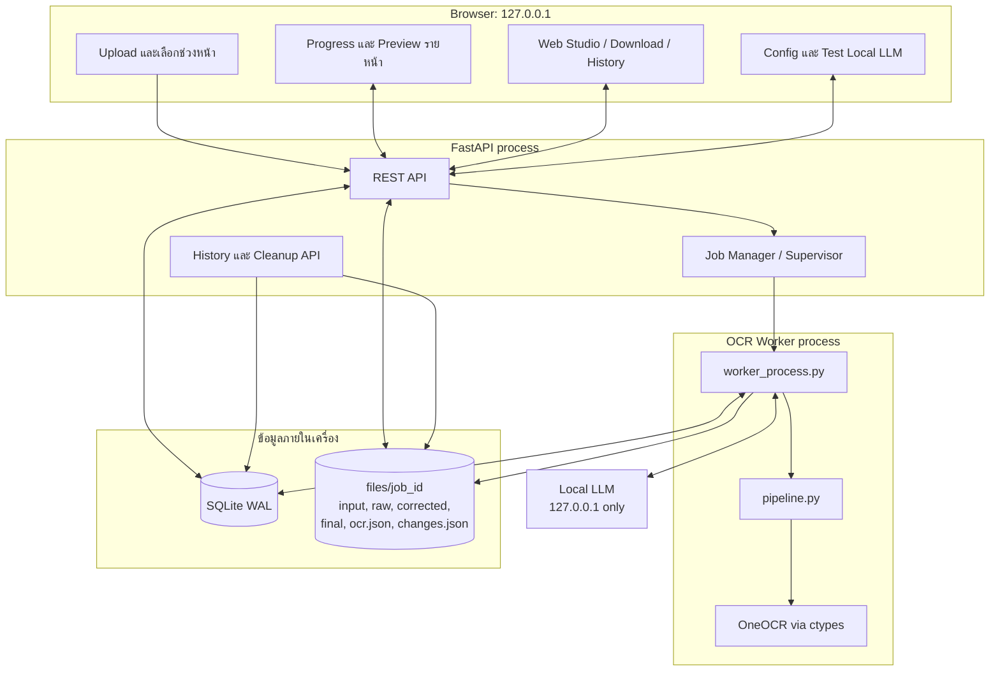
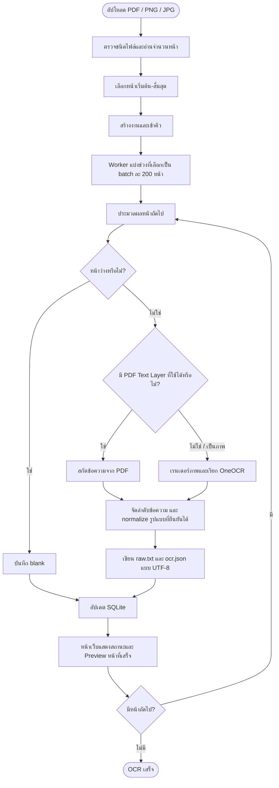
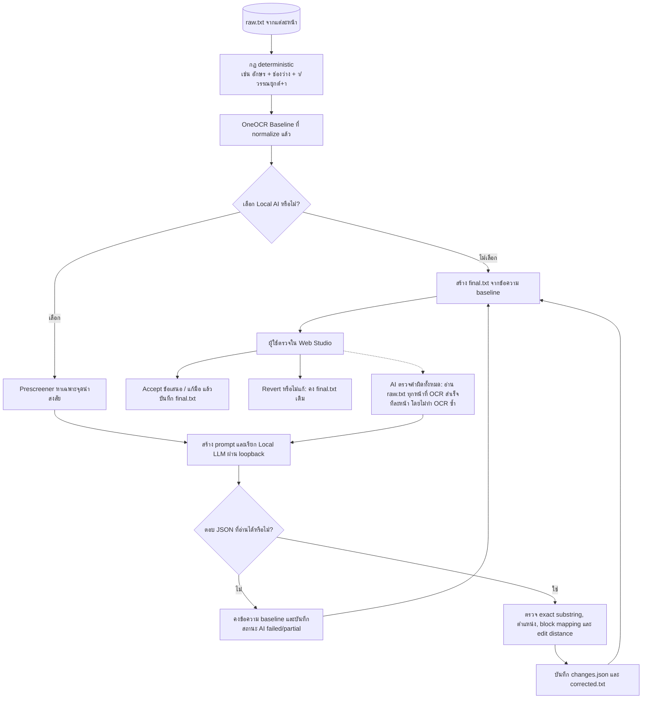
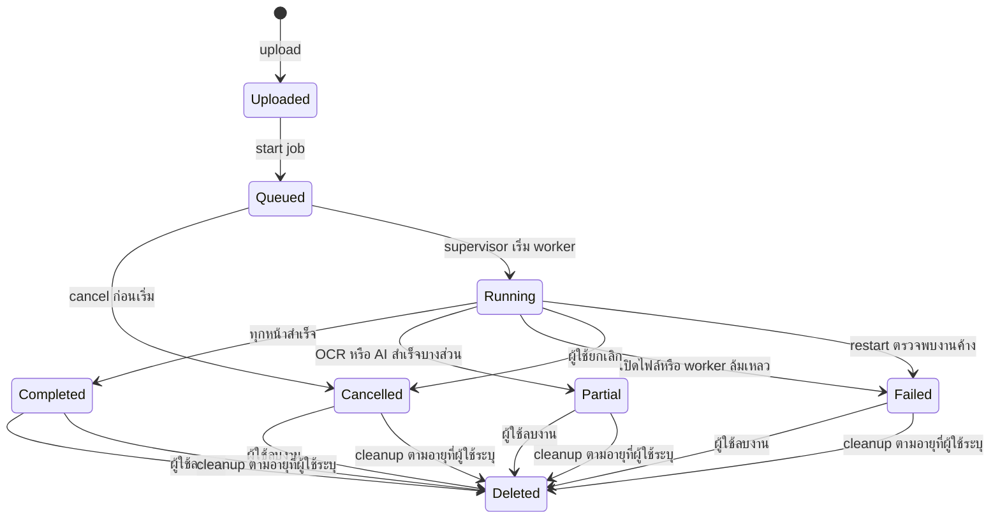
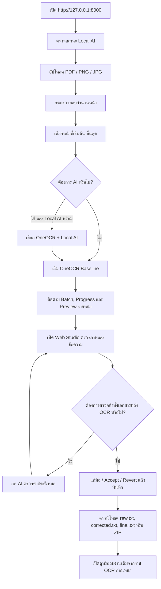

# Local Thai OCR Web

[-0078D6.svg?logo=windows)](https://microsoft.com)
[-3776AB.svg?logo=python)](https://python.org)
[](https://fastapi.tiangolo.com)
[-critical.svg)](#จุดเด่นของระบบ-key-features)
[](#การตั้งค่า-local-ai-ตรวจแก้)
[](#จุดเด่นของระบบ-key-features)

เว็บแอปพลิเคชันสำหรับแปลงเอกสาร **PDF และภาพภาษาไทยเป็นข้อความ UTF-8** ขับเคลื่อนด้วย **OneOCR** (เอนจิน OCR ภาษาไทยแบบเนทีฟจาก Windows 11 Snipping Tool ผ่าน Python `ctypes`) พร้อมระบบจัดลำดับข้อความอัจฉริยะ (Smart Layout Assembly) และผสานพลัง **Local AI (LLM/VLM)** ช่วยตรวจแก้คำผิด สระ และวรรณยุกต์ โดยประมวลผล **ภายในเครื่อง 100% (Localhost Single-User)** โดยไม่ส่งข้อมูลออกนอกเครื่อง พร้อมหน้าเว็บ **Web Studio** สำหรับตรวจทาน เทียบภาพต้นฉบับ แก้ไข และส่งออกไฟล์

> [!IMPORTANT]
> ระบบรองรับ Windows 10/11 แบบ 64-bit เท่านั้น เพราะใช้ OneOCR DLL แบบ 64-bit และออกแบบให้ใช้งานจาก `127.0.0.1` บนเครื่องเดียว

## เริ่มใช้งานด่วนจาก GitHub

หลัง clone repository แล้ว ให้เปิด PowerShell ที่โฟลเดอร์โครงการและรัน:

```powershell
.\run_server.ps1
```

หากใช้ Command Prompt ให้รัน:

```cmd
.\run_server.cmd
```

สคริปต์จะสร้าง `venv` และติดตั้ง dependencies ให้เองในครั้งแรก จากนั้นเปิด [http://127.0.0.1:8000/](http://127.0.0.1:8000/) ในเบราว์เซอร์

หาก PowerShell ไม่อนุญาตให้รัน script ให้ใช้คำสั่งนี้เฉพาะหน้าต่างปัจจุบัน แล้วรันใหม่:

```powershell
Set-ExecutionPolicy -Scope Process Bypass
```

### โหมด OCR และ Local AI

- ค่าเริ่มต้นคือ **OneOCR อย่างเดียว (Baseline)** จึงใช้งาน OCR ได้แม้ไม่ได้เปิด Local LLM
- เลือกช่วงหน้าเริ่มต้น–สิ้นสุดได้ตามจำนวนหน้าของเอกสาร; ระบบแบ่งทำงานเป็น **batch ละ 200 หน้า** ต่อเนื่องจนจบช่วงที่เลือก
- เมื่อ OCR แต่ละหน้าเสร็จ หน้า Preview จะเปลี่ยนไปแสดงภาพและข้อความของหน้านั้นทันที
- เมื่อ Local AI เป็น Offline ระบบจะล็อก **OneOCR + Local AI ตรวจแก้คำ** ไว้
- กด **ทดสอบการเชื่อมต่อ** ข้างสถานะ Local AI; เมื่อเชื่อมต่อและพบโมเดลแล้ว ตัวเลือก AI จะถูกปลดล็อก

---

## สารบัญ

- [เริ่มใช้งานด่วนจาก GitHub](#เริ่มใช้งานด่วนจาก-github)
- [จุดเด่นของระบบ (Key Features)](#จุดเด่นของระบบ-key-features)
- [สถาปัตยกรรมและแผนภาพการทำงาน (Architecture & Diagrams)](#สถาปัตยกรรมและแผนภาพการทำงาน-architecture--diagrams)
  - [1. แผนภาพสถาปัตยกรรมระบบและการแยก Process](#1-แผนภาพสถาปัตยกรรมระบบและการแยก-process)
  - [2. แผนภาพการประมวลผลและการจัดเส้นทางเอกสาร (Intelligent Page Routing)](#2-แผนภาพการประมวลผลและการจัดเส้นทางเอกสาร-intelligent-page-routing)
  - [3. แผนภาพการตรวจแก้ด้วย Local AI และ Diff Engine](#3-แผนภาพการตรวจแก้ด้วย-local-ai-และ-diff-engine)
  - [4. แผนภาพวงจรสถานะงานและการกู้คืนข้อผิดพลาด (Job Lifecycle & Fault Tolerance)](#4-แผนภาพวงจรสถานะงานและการกู้คืนข้อผิดพลาด-job-lifecycle--fault-tolerance)
  - [5. แผนภาพขั้นตอนการทำงานของผู้ใช้บนหน้าเว็บ (End-to-End User Experience Flow)](#5-แผนภาพขั้นตอนการทำงานของผู้ใช้บนหน้าเว็บ-end-to-end-user-experience-flow)
- [การติดตั้งและเริ่มต้นใช้งาน (Getting Started)](#การติดตั้งและเริ่มต้นใช้งาน-getting-started)
  - [ความต้องการของระบบ](#ความต้องการของระบบ-prerequisites)
  - [ติดตั้งและเริ่มต้นใช้งาน](#การติดตั้งและเริ่มต้นใช้งาน-getting-started)
- [การตั้งค่า Local AI ตรวจแก้](#การตั้งค่า-local-ai-ตรวจแก้)
- [สัญญาข้อมูลและไฟล์ผลลัพธ์ (Data Contract)](#สัญญาข้อมูลและไฟล์ผลลัพธ์-data-contract)
- [โครงสร้างโฟลเดอร์ (Repository Structure)](#โครงสร้างโฟลเดอร์-repository-structure)
- [ผลการทดสอบและเกณฑ์ตรวจรับ (Verification & Benchmarks)](#ผลการทดสอบและเกณฑ์ตรวจรับ-verification--benchmarks)
- [ข้อควรรู้ก่อนเผยแพร่บน GitHub](#ข้อควรรู้ก่อนเผยแพร่บน-github)

---

## จุดเด่นของระบบ (Key Features)

1. **OneOCR ภาษาไทยแท้ (High Accuracy OCR):**
   - โหลดโมเดล `oneocr.dll` และ `oneocr.onemodel` ผ่าน Python `ctypes` โดยตรง ไม่ต้องติดตั้งโปรแกรม C++ เพิ่มเติม
   - อัตราความผิดพลาดต่ำมาก (**CER 0.04%** บนเอกสารไทยตัวพิมพ์ชัด และ **CER รวม 0.83%** บนชุดตรวจรับ)
2. **Hybrid PDF Pipeline (ตรวจจับและจัดเส้นทางอัจฉริยะ):**
   - แยกแยะหน้าเอกสารอัตโนมัติ: ดึง Text Layer ตรงจาก Digital PDF ที่สมบูรณ์ หรือเรนเดอร์ภาพความละเอียดสูงเพื่อทำ OCR สำหรับหน้าสแกน/ภาพ
   - ตรวจจับหน้าว่างจริง (`blank`) ไม่ทิ้งหน้าและไม่แสดงเป็นข้อความว่างลึกลับ
3. **Interactive Dual-Pane Web Studio:**
   - หน้าจอทำงานแบบแยก 2 ฝั่ง (ต้นฉบับ vs ข้อความที่แปลงได้)
   - **Bidirectional Bounding Box Sync:** คลิกคำ/บรรทัดบนข้อความ กรอบสีบนภาพต้นฉบับจะเลื่อนและไฮไลต์ตำแหน่งทันที และสามารถคลิกกรอบบนภาพเพื่อวิ่งไปยังข้อความได้เช่นกัน
   - แสดงหน้า Preview ที่เพิ่ง OCR เสร็จระหว่างงานทำงาน โดยไม่สลับหน้าหากมีข้อความแก้มือที่ยังไม่บันทึก
4. **Local AI Correction & Diff Engine:**
   - เริ่มต้นเป็น OneOCR only; เปิด AI ได้เมื่อทดสอบการเชื่อมต่อ Local LLM ผ่านแล้ว
   - ใช้กฎ deterministic สำหรับ OCR ที่แยก `ำ` เป็น ` า` หรือ ` ้า` ก่อนส่งคำที่เหลือให้ Local LLM เสนอการแก้
   - ปุ่ม **AI ตรวจคำผิดทั้งหมด** อ่าน `raw.txt` ของทุกหน้าที่ OCR สำเร็จแล้ว โดยไม่ทำ OCR ซ้ำ และเก็บผลเป็นข้อเสนอ
   - ปุ่ม **Accept / Revert** ทีละจุด หรือทั้งหมด พร้อมการันตีคืนค่า raw text byte-for-byte ได้ 100%
5. **Crash Isolation & Resilient Architecture:**
   - แยก **FastAPI Web Server** ออกจาก **OCR Worker Subprocess** อย่างเด็ดขาด ป้องกัน Native DLL Crash ไม่ให้เซิร์ฟเวอร์หลักหยุดทำงาน
   - จัดการคิวงานด้วย SQLite โหมด Write-Ahead Logging (WAL) พร้อมกู้คืนงานที่ค้าง (`recovering interrupted jobs`) หลังเปิดระบบใหม่
   - กลไกป้องกันการแก้ไขชนกันหลายแท็บ (Multi-tab Conflict Detection ด้วย ETag/Revision คืนค่า HTTP 409)
6. **Data Retention & Anti-Resurrection:**
   - หน้า **งาน OCR ก่อนหน้า** เปิดดู ดาวน์โหลด หรือลบงานทีละรายการได้ และลบงานที่เก่ากว่าจำนวนวันที่ผู้ใช้กำหนดได้
   - ป้องกันสภาวะ Race Condition: หากงานถูกลบไปแล้ว Worker จะยุติการเขียนไฟล์กลับคืนทันที (0 Resurrection)
7. **ความเป็นส่วนตัวและ Offline 100%:**
   - เซิร์ฟเวอร์ผูกเข้ากับ `127.0.0.1` (Loopback Only) ปฏิเสธการเข้าถึงจาก IP ภายนอกด้วย HTTP 403 Forbidden
   - ประมวลผลและเก็บข้อมูลบนเครื่องของผู้ใช้เท่านั้น ไม่ส่งข้อมูลใด ๆ ออกนอกเครือข่าย

---

## สถาปัตยกรรมและแผนภาพการทำงาน (Architecture & Diagrams)

ส่วนนี้อธิบายเส้นทางข้อมูลที่ใช้งานจริงในรุ่นปัจจุบัน: งาน OCR ทำใน Worker แยก process, ผลลัพธ์เขียนลงดิสก์ทีละหน้า, และหน้าเว็บอ่านสถานะจาก API เพื่อแสดงความคืบหน้าทันที

### 1. สถาปัตยกรรมระบบ



OneOCR DLL ถูกโหลดใน Worker เท่านั้น ดังนั้นความขัดข้องของ native OCR ไม่ทำให้ FastAPI process หยุดตามไปด้วย. API และ Local LLM จำกัดการเชื่อมต่อไว้ที่ loopback.

---

### 2. เส้นทาง OCR, batch และ Preview



ช่วงหน้าที่เลือกอาจยาวกว่า 200 หน้าได้; Worker จะทำต่อเนื่องเป็น batch ละ 200 หน้าเพื่อคืนทรัพยากร OCR ระหว่าง batch. เมื่อหน้าใดเสร็จ ระบบจะเขียนไฟล์และอัปเดตสถานะก่อนเริ่มหน้าถัดไป ทำให้ Preview แสดงผลหน้านั้นได้ทันที.

---

### 3. Baseline, Local AI และการตรวจทาน



ค่าเริ่มต้นคือ **OneOCR อย่างเดียว (Baseline)**. ตัวเลือก AI จะเปิดหลังการทดสอบการเชื่อมต่อพบ Local LLM เท่านั้น. `corrected.txt` เป็นผลข้อเสนอของ AI ส่วน `final.txt` เป็นฉบับที่ผู้ใช้ควบคุม.

---

### 4. วงจรสถานะงานและการเก็บข้อมูล



หน้า **งาน OCR ก่อนหน้า** แสดงงานล่าสุด เปิดดูหรือดาวน์โหลดงานเดิมได้. การลบรายงานและ cleanup จะไม่ลบงานที่อยู่ในสถานะ `queued` หรือ `running`; Worker ตรวจสถานะก่อนเขียนผลต่อเพื่อไม่ให้ไฟล์ที่ลบแล้วถูกสร้างกลับ.

---

### 5. ขั้นตอนใช้งานบนหน้าเว็บ



---

## การติดตั้งและเริ่มต้นใช้งาน (Getting Started)

### ความต้องการของระบบ (Prerequisites)
- **ระบบปฏิบัติการ:** Windows 10 หรือ Windows 11 (แบบ **64-bit** เท่านั้น เนื่องจาก OneOCR DLL เป็น 64-bit)
- **Python:** Python 3.10 ขึ้นไป (64-bit) พร้อม Python Launcher (`py`)
- **เว็บเบราว์เซอร์:** Google Chrome, Microsoft Edge หรือเบราว์เซอร์ Chromium ทันสมัย

---

### รันด่วน

ชุดนี้มีไฟล์ binary, model, backend และหน้าเว็บครบแล้ว:

1. เปิด **PowerShell** ในโฟลเดอร์นี้
2. หาก PowerShell บล็อกการรันสคริปต์ ให้ปลดล็อกชั่วคราว:
   ```powershell
   Set-ExecutionPolicy -Scope Process Bypass
   ```
3. รันสคริปต์ติดตั้งระบบ (จะสร้าง virtual environment และดาวน์โหลด dependencies อัตโนมัติ):
   ```powershell
   .\install.ps1
   ```
4. เริ่มต้นเซิร์ฟเวอร์:
   ```powershell
   .\run_server.ps1
   ```
   หรือใน Command Prompt:
   ```cmd
   .\run_server.cmd
   ```
5. เปิดเบราว์เซอร์ไปที่: **`http://127.0.0.1:8000/`**

---

### ติดตั้ง dependencies ด้วยตนเอง

ใช้เมื่อต้องการสร้าง virtual environment เองแทน `install.ps1`:

1. **ตรวจสอบโฟลเดอร์โมเดล OneOCR:**  
   ตรวจสอบว่ามีไฟล์ binary ครบถ้วนในโฟลเดอร์ `oneOCR/`:
   ```text
   oneOCR/
   ├── oneocr.dll        (DLL เอนจิน OneOCR)
   ├── oneocr.onemodel   (โมเดล ONNX สำหรับภาษาไทย/อังกฤษ)
   └── onnxruntime.dll   (ONNX Runtime 64-bit)
   ```

2. **สร้าง Virtual Environment และเปิดใช้งาน:**
   ```powershell
   py -3 -m venv venv
   .\venv\Scripts\Activate.ps1
   ```

3. **ติดตั้ง Dependencies:**
   ```powershell
   python -m pip install --upgrade pip
   python -m pip install -r requirements.txt
   ```

4. **เตรียมไฟล์การตั้งค่า (`.env`):**
   ```powershell
   Copy-Item .env.example .env
   ```

5. **เริ่มการทำงานของเซิร์ฟเวอร์:**
   ```powershell
   python -m uvicorn src.server:app --host 127.0.0.1 --port 8000 --reload
   ```

---

## การตั้งค่า Local AI ตรวจแก้

ระบบรองรับการเชื่อมต่อกับ **Local LLM / VLM** ผ่าน OpenAI-compatible API (เช่น [LM Studio](https://lmstudio.ai/) หรือ [Ollama](https://ollama.com/)) โดยมีขั้นตอนดังนี้:

1. เปิดโปรแกรม Local LLM และโหลดโมเดลที่ต้องการ (เช่น `google/gemma-3-1b` หรือโมเดลภาษาไทยอื่น ๆ)
2. เริ่มการทำงานของ Local Server ที่ `http://127.0.0.1:1234/v1`
3. เข้าหน้าเว็บตั้งค่าของระบบ: **`http://127.0.0.1:8000/config.html`**
4. กรอกข้อมูลการเชื่อมต่อ:
   - **Base URL:** `http://127.0.0.1:1234/v1` *(จำกัดเฉพาะ localhost/127.0.0.1 เพื่อความปลอดภัย)*
   - **Model:** ระบุชื่อโมเดล เช่น `google/gemma-3-1b`
   - **Timeout:** ค่าเริ่มต้น `60.0` วินาที
5. กดปุ่ม **"ทดสอบการเชื่อมต่อ"** เมื่อขึ้นสถานะพร้อมใช้งาน ให้กด **"บันทึกการตั้งค่า"**
6. ค่าจะถูกบันทึกลง `.env` และมีผลกับงาน OCR+AI รอบถัดไปทันที

---

### ผลทดสอบ Local LLM: ปัญหาสระ `ำ` จาก OCR

ทดสอบเมื่อ 2026-09-29 ผ่าน Local OpenAI-compatible API ที่ `127.0.0.1:1234` โดยวัดว่าผลแก้ไขตรงกับคำที่คาดหวังและสามารถนำไป apply กับข้อความต้นทางได้จริง ชุดทดสอบมี 13 คำ เช่น `ท างาน` → `ทำงาน`, `น ้าท่วม` → `น้ำท่วม`, `ด าน า` → `ดำนำ`, `ข้าวย า` → `ข้าวยำ` และ `เงื่อนง า` → `เงื่อนงำ`.

| วิธี / โมเดล | ผลถูกต้อง | เวลาโดยประมาณ | ข้อสรุป |
|---|---:|---:|---|
| Baseline deterministic rule | **13/13** | ทันที | ใช้เป็นแนวป้องกันหลักสำหรับรูปแบบ “อักษร + เว้นวรรค + า/วรรณยุกต์+า” |
| `google/gemma-4-e2b` | **10/13** | ~108 วินาที | แก้ `ด าน า` ผิดเป็น `ด้านำ`, `ข าขัน` ผิดเป็น `ข้าขัน`, และ `ข้าวย า` ผิดเป็น `ข้าวยา`; ไม่เหมาะเป็นค่าเริ่มต้น |
| `google/gemma-3-1b` | **0/13** | ~64 วินาที | เสนอ `original_text` ไม่ตรงข้อความต้นทางและแก้คำไม่ถูกต้อง จึง apply ผลจริงไม่ได้ |

`gemma-4-e2b` สร้าง `reasoning_content` ก่อนคำตอบ: เมื่อใช้ `max_tokens=600` คำตอบสุดท้ายว่าง เพราะ reasoning ใช้ token หมด; การทดสอบข้างต้นจึงใช้ `max_tokens=1600` และพบ reasoning 685 token. ระบบจึงยังคงใช้กฎ deterministic กับปัญหาสระ `ำ` และให้ Local LLM เสนอการแก้กรณีอื่นเพื่อให้ผู้ใช้ตรวจทานก่อนยอมรับ

#### ตรวจสอบผลของ Prompt กับ `google/gemma-3-1b`

ทดสอบเพิ่มเมื่อ 2026-09-29 ผ่าน API เดิม โดยใช้ `temperature=0` และ `max_tokens=800` เพื่อแยกปัญหา prompt ออกจากการเชื่อมต่อโมเดล ผลพบว่า prompt มีผลต่อรูปแบบคำตอบ แต่โมเดลยังไม่เสถียรกับการประกอบอักขระไทยและ Structured JSON จึงไม่ใช่สาเหตุเดียวของผล 0/13.

| ชุดทดลอง | Prompt ที่ใช้ | ผลตอบกลับ | สรุป |
|---|---|---|---|
| Prompt ระบบปัจจุบัน + 12 คำ | `You are a Thai OCR correction engine. Return only valid JSON ... Do not romanize Thai.` และ `Correct only OCR spelling mistakes ... original_text must be copied exactly from the input.` | ส่ง fenced JSON ที่มี object ราก 2 ตัว; `original_text` ตัดช่องว่างและ `corrected_text` ไม่แก้เป็น `ำ` | JSON ใช้ไม่ได้และไม่ผ่าน validator |
| Prompt ไทยแบบ few-shot + 12 คำ | `ตัวอย่าง: ข้อความ \`ท างาน\` -> {"corrections":[{"original_text":"ท างาน","corrected_text":"ทำงาน"}]}` แล้วสั่งให้แก้รูปแบบอักษร+ช่องว่าง+า โดยคัดลอก `original_text` ตรงตัว | แก้ `ท างาน` → `ทำงาน` ได้ แต่ตอบเพียง 1 รายการจาก 12 | few-shot ช่วยเฉพาะกรณีตัวอย่าง แต่ไม่รองรับงานหลายรายการ |
| คำถามเดี่ยว | `ข้อความ OCR คือ \`ผู้อ านวยการ\` คำที่ถูกต้องคืออะไร? ตอบเฉพาะคำไทยหนึ่งคำ ห้ามอธิบาย ห้ามใช้อักษรอังกฤษ` | `ผู้อานวยการ` | ยังลบช่องว่างแต่ไม่สร้าง `ำ` |
| คำถามสั้น | `รวม \`ท างาน\` ให้เป็นคำไทยที่ถูกต้อง แล้วตอบเฉพาะผลลัพธ์` | ตอบเป็นรายการคำหลายคำ เช่น `การทำงาน`, `การทำหน้าที่` | ไม่ทำตามรูปแบบผลลัพธ์และมีการแต่งเติม |

ข้อความ prompt เต็มของชุด few-shot ที่ให้ผลดีที่สุดในการทดสอบนี้:

```text
ตอบ JSON เท่านั้น ห้ามอธิบาย ห้ามแปลไทยเป็นอักษรโรมัน

ตัวอย่าง: ข้อความ `ท างาน` -> {"corrections":[{"original_text":"ท างาน","corrected_text":"ทำงาน"}]}

จงแก้เฉพาะช่องว่างที่ทำให้สระ ำ กลายเป็น อักษร+ช่องว่าง+า ในรายการนี้ โดยคัดลอก original_text ตรงตัว:
ท างาน
ผู้อ านวยการ
ส ารวจ
ก าลัง
น ้าท่วม
น าเกลือ
ด าน า
ข าขัน
ค าพูด
ข้าวย า
ล าน ้า
เงื่อนง า
```

ข้อความ prompt อื่นที่ใช้ในการทดสอบ (รายการ 12 คำใช้ชุดเดียวกับด้านบน):

```text
[system]
You are a Thai OCR correction engine. Return only valid JSON:
{"corrections":[{"original_text":"exact substring","corrected_text":"corrected Thai","category":"spelling","reason":"short"}]}
Do not romanize Thai.

[user]
Correct only OCR spelling mistakes in this text. original_text must be copied exactly from the input.
<รายการ 12 คำด้านบน>

[single question]
ข้อความ OCR คือ `ผู้อ านวยการ`
คำที่ถูกต้องคืออะไร? ตอบเฉพาะคำไทยหนึ่งคำ ห้ามอธิบาย ห้ามใช้อักษรอังกฤษ

[short question]
รวม `ท างาน` ให้เป็นคำไทยที่ถูกต้อง แล้วตอบเฉพาะผลลัพธ์
```

ดังนั้นระบบใช้กฎ deterministic ที่ตรวจสอบได้สำหรับรูปแบบนี้ต่อไป; Local LLM ใช้เสนอการแก้กรณีอื่นเท่านั้น และทุกผลต้องผ่าน validator ก่อนนำไปใช้

---

## สัญญาข้อมูลและไฟล์ผลลัพธ์ (Data Contract)

ไฟล์ต้นฉบับและผลลัพธ์ของแต่ละงานจะถูกจัดเก็บแยกตามโฟลเดอร์ใน `files/{job_id}/`:

| ชื่อไฟล์ | คำอธิบายและเนื้อหา |
|---|---|
| **`raw.txt`** | ข้อความดิบที่ประกอบตามลำดับอ่านที่ได้จาก PDF Text หรือ OneOCR ก่อนผ่าน AI |
| **`corrected.txt`** | ข้อความหลังผ่าน Local AI ตรวจแก้ตามโครงสร้าง JSON (มีเฉพาะเมื่อเปิดโหมด AI) |
| **`final.txt`** | ข้อความฉบับทำงานล่าสุดที่ผู้ใช้แก้ไข หรือยอมรับข้อเสนอผ่านหน้าเว็บ |
| **`ocr.json`** | ข้อมูลเชิงลึกของทุกหน้า: บล็อกข้อความ, พิกัด Bounding Box 4 จุด, เส้นทางที่ใช้ (Routing) และสถานะ |
| **`changes.json`** | รายการข้อเสนอการแก้ไขของ AI: ข้อความเดิม, ข้อความใหม่, ตำแหน่งออฟเซ็ต และสถานะ (`pending`, `accepted`, `reverted`) |

---

## โครงสร้างโฟลเดอร์ (Repository Structure)

```text
publish/
├── src/                    # ซอร์สโค้ดหลักของ Backend และ OCR Pipeline
│   ├── server.py           # FastAPI Web Application & REST Endpoints
│   ├── pipeline.py         # OCR & Assembly Processing Pipeline
│   ├── worker_process.py   # OCR Subprocess Worker (โหลด oneocr.dll แยก)
│   ├── job_manager.py      # Job Supervisor & Process Queue Manager
│   ├── database.py         # SQLite WAL Database Handler
│   ├── oneocr_wrapper.py   # OneOCR ctypes Wrapper & ABI Definitions
│   ├── diff_engine.py      # Character-level Diff & Proposal Engine
│   ├── llm_client.py       # Local LLM OpenAI-compatible Client
│   └── cleanup_service.py  # ลบงานตามคำสั่งจากหน้า History / API
├── static/                 # หน้าเว็บและส่วนติดต่อผู้ใช้ (Frontend)
│   ├── index.html          # หน้าจอหลัก Web Studio Dual-Pane Viewer
│   ├── config.html         # หน้าจอตั้งค่า Local LLM
│   ├── app.js              # ตรรกะการทำงานฝั่งไคลเอนต์ (Vanilla JS)
│   └── app.css             # ดีไซน์และชุดแต่ง Modern Dark/Light Theme
├── oneOCR/                 # OneOCR Binary DLL & Model Runtime (64-bit)
├── data/                   # SQLite job database (สร้างขณะใช้งาน)
├── files/                  # ไฟล์อัปโหลดและผลลัพธ์ (สร้างขณะใช้งาน)
├── checklist.md            # จุดตรวจบังคับและเกณฑ์การตรวจรับราย Phase
├── manual.md               # คู่มือการติดตั้ง เริ่ม/หยุดระบบ และการบำรุงรักษา
├── install.ps1             # สร้าง virtual environment และติดตั้ง dependencies
├── run_server.cmd          # เริ่ม server จาก Command Prompt
├── run_server.ps1          # เริ่ม FastAPI server
├── requirements.txt        # Python dependencies
└── readme.md               # เอกสารภาพรวมและขอบเขตของโครงการ (หน้านี้)
```

---

## ผลการทดสอบและเกณฑ์ตรวจรับ (Verification & Benchmarks)

สถานะด้านล่างสรุปจากหลักฐานที่บันทึกในโครงการ ณ วันที่ 2026-09-29 เพื่อไม่ให้ผลที่ยังไม่มีหลักฐานถูกแสดงเป็นผ่าน

### ผ่านตามขอบเขตที่ทดสอบ

| รายการทดสอบ | เกณฑ์ที่กำหนด | ผลการทดสอบจริง | สถานะ |
|---|---|---|:---:|
| **CER เอกสารไทยตัวพิมพ์ชัด** | $\le 5.0\%$ | **0.04%** | **PASSED** |
| **CER รวมทุกกลุ่มเอกสาร (Routing จริง)** | $\le 10.0\%$ | **0.83%** | **PASSED** |
| **ความถูกต้องของช่องข้อมูลสำคัญ (Key Fields)** | $\ge 95.0\%$ (Exact Match) | **100.00% (146/146 ช่อง)** | **PASSED** |
| **Diff Engine & Revert Fidelity** | Diff 100%, Revert 100% | ตรงกับ raw text byte-for-byte 100% | **PASSED** |
| **ความเสถียรสะสม $\ge 200$ หน้าต่อเนื่อง** | ไม่มี Crash, ไม่ OOM | 200/200 หน้าสำเร็จ (Peak RAM **33.28 MB**) | **PASSED** |
| **การทำงานแบบออฟไลน์ (Network Isolation)** | 0 คำขอนอก Loopback | บล็อกทุก external network request 100% | **PASSED** |
| **Browser Automation (Chrome & Edge)** | ทำงานสมบูรณ์ผ่านเว็บ | ผ่าน 100% ทั้ง Google Chrome และ Edge | **PASSED** |
| **Backend, queue และ recovery** | สถานะงานและการกู้คืนถูกต้อง | ผ่าน 21/21 tests | **PASSED** |
| **หน้าเว็บเลือกช่วงและ batch OCR** | เลือกช่วง, แบ่ง batch ละ 200 หน้า และตรวจ scope | ผ่าน 5/5 tests | **PASSED** |

### ไม่ผ่าน

| รายการทดสอบ | ผล | สาเหตุ |
|---|:---:|---|
| Local LLM `google/gemma-3-1b` สำหรับชุดทดสอบสระ `ำ` 13 คำ | **FAILED (0/13)** | ผลแก้ไม่ตรงต้นฉบับหรือคำที่คาดหวัง จึงไม่ผ่าน validator และไม่ใช้เป็น baseline |
| Local LLM `google/gemma-4-e2b` สำหรับชุดทดสอบสระ `ำ` 13 คำ | **PARTIAL (10/13)** | มีคำแก้ผิด 3 คำและใช้เวลานาน จึงไม่ใช้เป็น default |

### ยังไม่ได้ทดสอบ / รอหลักฐาน / ยกเว้นชั่วคราว

| รายการ | สถานะ | เหตุผลหรือขอบเขตที่เหลือ |
|---|:---:|---|
| ชุดเอกสารขยาย 2,185 หน้า | **NOT TESTED** | ต้องประมวลผลครบ ตรวจ disk mapping และจัดทำ ground truth ก่อนรับรอง Phase 2–3 ครอบคลุมไฟล์ขยาย |
| Benchmark AI สำหรับเอกสารขยาย | **NOT TESTED** | รอ Phase 2 และ ground truth ที่ล็อกแล้ว |
| งานจริง 100 หน้า: เวลา/RAM/VRAM | **NOT TESTED** | ไม่มีเอกสารทดสอบที่ตรงเงื่อนไขเดิม; ผลเสถียรภาพ 200 หน้าไม่ทดแทนเกณฑ์นี้ |
| Accept/Revert จากข้อเสนอ AI จริง 10 จุด | **NOT TESTED** | ยังไม่มีเอกสารจริงที่สร้างข้อเสนอได้ครบ 10 จุด |
| ภาพหมุน 90° / 180° / 270° | **NOT TESTED** | ไม่มีตัวอย่างเอกสารจริงสำหรับตรวจรับ |
| PDF เสีย, PDF ติดรหัสผ่าน และภาพใหญ่ | **EXEMPTED** | ยกเว้นโดยเจ้าของงาน; ระบบยังคงตอบ error HTTP 400/422/413 |
| ติดตั้งบน clean target machine จากศูนย์ | **NOT TESTED** | รอทดสอบบนเครื่องปลายทางจริงหรือจัดเตรียม wheelhouse แบบ offline |
| การยอมรับข้อจำกัดก่อนใช้งานจริง | **PENDING** | รอเจ้าของงานตรวจผลและยอมรับข้อจำกัดที่ระบุไว้ |

## ข้อควรรู้ก่อนเผยแพร่บน GitHub

- ห้าม commit `.env`, `venv/`, `data/jobs.db` และไฟล์ใน `files/` เพราะอาจมีค่า Local LLM หรือเอกสารที่ผู้ใช้อัปโหลด
- repository มี `.gitignore` สำหรับตัดไฟล์ runtime เหล่านี้ออกแล้ว
- ตรวจสิทธิ์การแจกจ่าย OneOCR binary และ model ตามนโยบายองค์กรหรือสิทธิ์ของ Windows ก่อนเผยแพร่ repository แบบสาธารณะ
- การตรวจแก้ด้วย AI เป็นทางเลือก; ผู้ใช้ใหม่ยังใช้งาน OCR แบบ Baseline ได้โดยไม่ต้องติดตั้งหรือเปิด Local LLM

---

## สิทธิ์การใช้งานและข้อจำกัดความรับผิดชอบ (License & Disclaimer)

- ซอร์สโค้ดและระบบเว็บนี้พัฒนาขึ้นเพื่อการใช้งานภายในเครื่อง (Localhost Desktop Utility)
- ไบนารีและโมเดล OneOCR (`oneocr.dll`, `oneocr.onemodel`, `onnxruntime.dll`) มาจาก Windows 11 Snipping Tool สำหรับการใช้งานส่วนบุคคลบนระบบปฏิบัติการ Windows ที่มีลิขสิทธิ์ถูกต้อง
